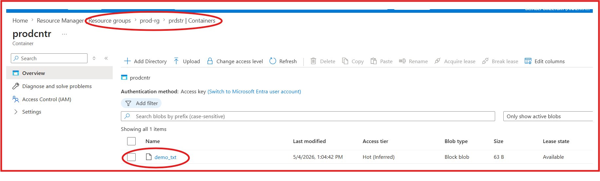

# Topic 01: End-to-End Azure Infrastructure Deployment (Hardcoded)

## 📌 Project Overview

In this project, I used Terraform to deploy a complete infrastructure flow on Azure. The goal was to understand the basic resource creation process and data upload to a storage service using a hardcoded configuration.

## 🏗️ Resources Created
* **Resource Group:** A logical container named `prod-rg`.
* **Storage Account:** A Standard LRS storage account named `prdstr`.
* **Storage Container:** A private container named `prodcntr` for data storage.
* **Storage Blob:** A local file (`demo.txt`) uploaded to the Azure container.

## 📸 Deployment Proof
Below is the screenshot from the Azure Portal verifying the successful deployment and file upload:

## 🛠️ Terraform Commands Used
1. `terraform init`: Initialized the working directory and downloaded providers.
2. `terraform plan`: Generated an execution plan to preview changes.
3. `terraform apply`: Deployed the infrastructure and uploaded the blob.

## 💡 Key Learnings
* Setting up the AzureRM Provider.
* Understanding resource hierarchy and dependencies in Azure.
* Basic state management and portal verification.

---
