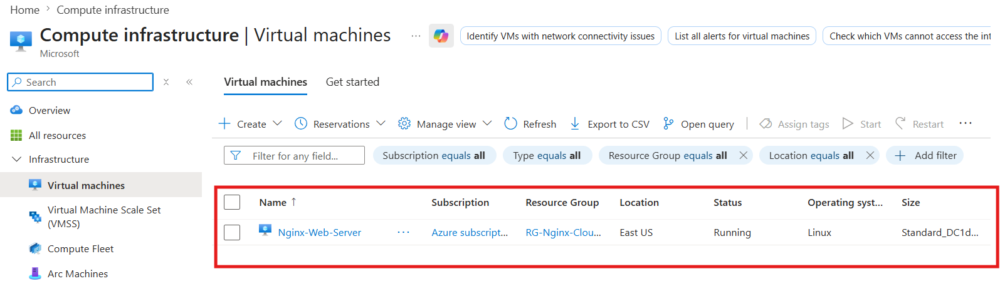
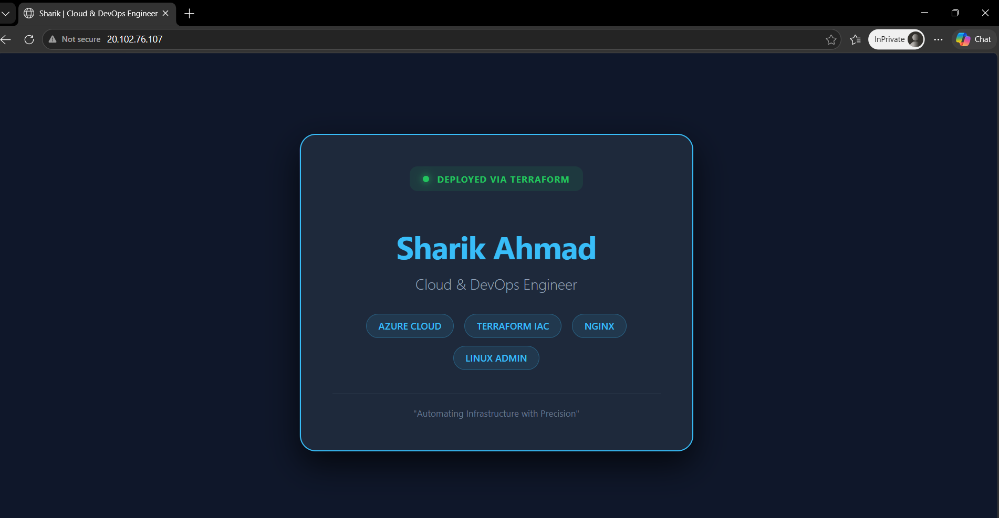

# 🚀 Automated Web Stack Deployment (Azure + Terraform)

---

## 📌 Overview

This project demonstrates a Zero-Touch Deployment approach where both infrastructure and application are deployed together automatically.

Instead of manually creating a VM and installing software, everything is handled in one go using automation.

---

## 🎯 Why This Project?

Traditional workflow:

- Create infrastructure
- Login manually (SSH)
- Install software
- Deploy code

**❌ This wastes time and causes human errors**
---

**👉 This project solves that by:**

- No manual login required  
- Fully automated setup  
- Website goes live instantly after deployment  

---

## 🛠️ Architecture Workflow

### Step 1: Infrastructure Setup

Terraform (main.tf + variables.tf) is used to create:

- Virtual Network  
- Subnet  
- Virtual Machine  
- Security rules  

✅ VM is configured to be **self-configuring at launch**

---

### Step 2: Bootstrap Script (setup.sh)

This script runs automatically when VM starts for the first time

👉 It does:

- System update  
- Install Nginx  
- Deploy website code  

✅ No need to login manually

---

### Step 3: Application Deployment

Instead of using SSH or SCP:

👉 We directly embedded the website code inside setup.sh

Result:

- As soon as Terraform finishes  
- Website is already live  

🚀 No manual steps required

---

## 📂 Project Structure

├── main.tf # Azure infrastructure setup
├── variables.tf # Input variables
├── setup.sh # Bootstrap script (installs Nginx + deploys code)

---

## ⚙️ How It Works

- Terraform reads main.tf  
- Azure resources are created  
- VM starts and executes setup.sh using user_data  
- Script installs Nginx and deploys HTML code  
- Website becomes live instantly using Public IP  

---

## 📸 Screenshots

### 🖥️ 1. VM Creation (Infrastructure Ready)

---

### 🌐 2. Website Live (Final Output)

---

## 💡 Key Learning

- Infrastructure as Code (IaC)
- Automation using Bootstrap Scripts
- Zero-Touch Deployment concept
- Faster and error-free deployments

---

### 🚀 Final Thought

As a DevOps Engineer, the goal is to automate everything.
By combining infrastructure and application deployment into one workflow, we achieve speed, consistency, and efficiency.

---

### 👨‍💻 Author

**Sharik Ahmad**
🚀 Focused on Automation, Cloud, and DevOps