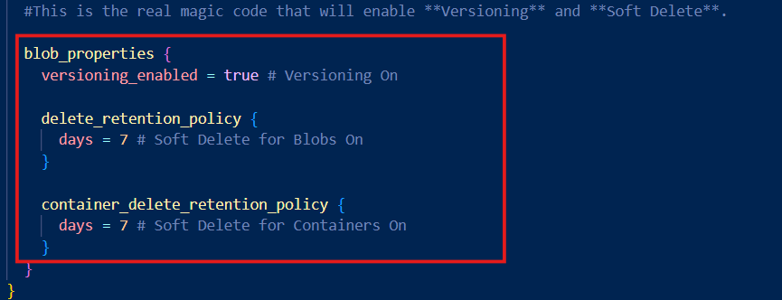
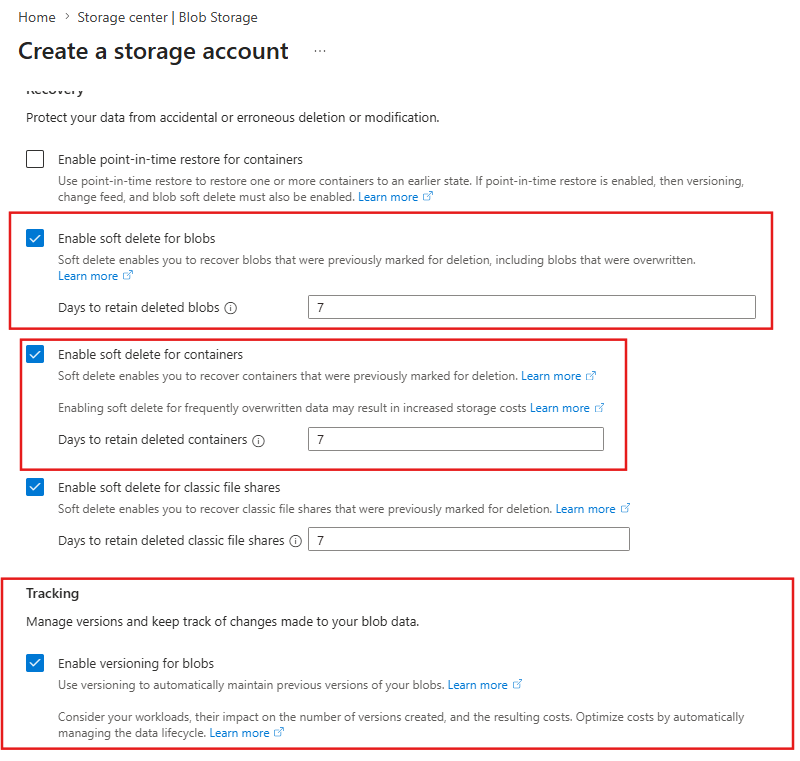
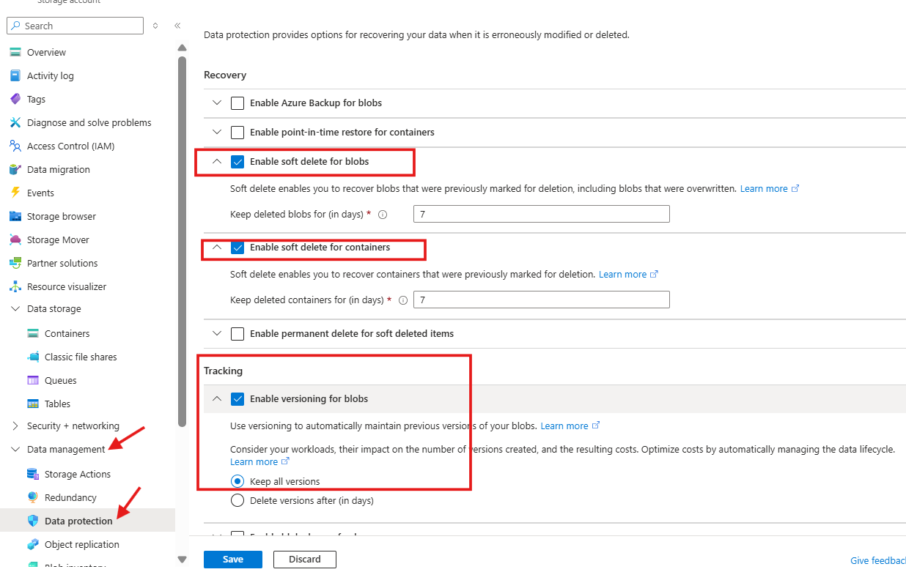
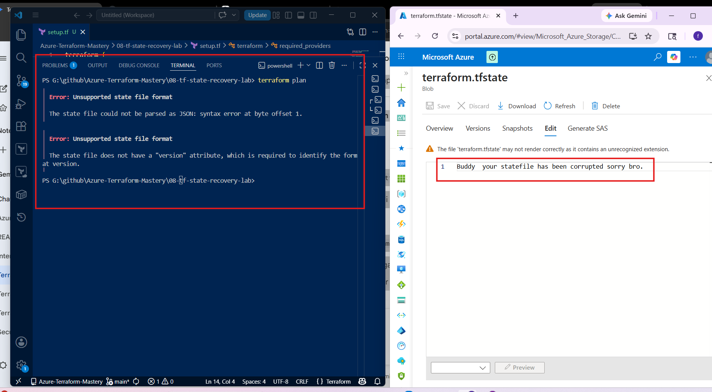
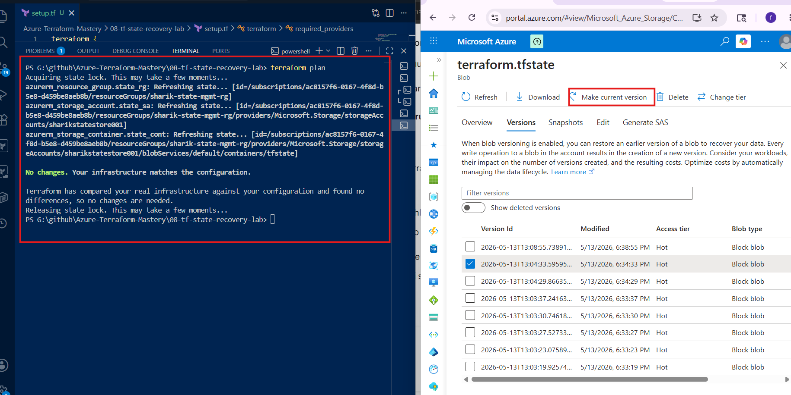
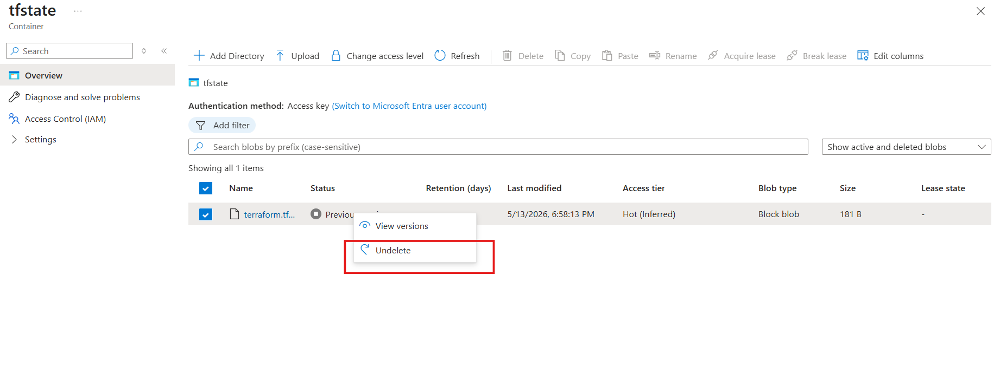

# 🧾 Terraform State File Versioning & Recovery Lab

---

## 📌 What is a State File?

**Terraform state file is a file that stores the current state of your infrastructure**.

---

## 🎯 Lab Objective

**In this lab, we will**:

- Enable Versioning and Soft Delete
- Upload state file to Azure Storage
- Corrupt and delete the state file
- Recover it using Azure features

---

## 🧠 Why This Project Matters

**In real-world DevOps**:

- State file = single source of truth
- If it breaks → infra management fails ❌
- So we use:
            -Versioning ✅
            -Soft Delete ✅

# ⚙️ Ways to Enable Versioning & Soft Delete

**You can enable it in 3 ways**:

### While creating resources using Terraform

---

### While creating Storage Account manually from Azure Portal

---

### Enable Versioning & Soft Delete After Storage Account Creation

**Go to Storage Account → Data Management → Data Protection → Enable Versioning & Soft Delete**

---

### 🏗️ Lab Architecture (Simple Flow)

- Terraform → Azure Storage Account → Container → terraform.tfstate

# 🚀 Lab Execution Steps

**Phase 1: Terraform Setup — Create Resource Group, Storage Account (with Versioning & Soft Delete), and Container, then use the backend block to upload the Terraform state file to Azure.**

---

### 💥 Phase 2: Destruction & Recovery Test

**⚠️ Scenario A: State Corruption (Edit Disaster)**

- For this lab, we will intentionally corrupt the state file and then recover it.

**🧨 Attack (Corruption)**

- Go to Azure Portal → Storage Container (tfstate)
- Click on terraform.tfstate
- Click Edit

- Delete all JSON and write:

**Bhai, teri state file corrupt ho gayi hai**!

- Click Save

❌ Impact

- run : terraform plan

- 👉 Error:

- Error loading state: invalid character 'B'

---

**🛠️ Recovery**

- Go to Versions tab
- Select older version (correct one)
- Click Make current version
- ✅ Verification

- Run: terraform plan

- 👉 It will work fine again ✅

---

**⚠️ Scenario B: Accidental Deletion (Delete Disaster)**

- For this lab, we will intentionally delete the state file and then recover it.

**🧨 Attack (Deletion)**

- Select terraform.tfstate
- Click Delete
- Container will look empty
- ❌ Impact

- Run:terraform plan

- 👉 Terraform will think:

- No infrastructure exists
- It will try to recreate everything

---

**🛠️ Recovery**

- Enable Show deleted blobs
- Find deleted file (faded)
- Click Undelete
- ✅ Verification

- Run:terraform plan

- 👉 Output:

**No changes. Your infrastructure matches the configuration**.

---

### 🧠 Conclusion

- Versioning helps recover corrupted files
- Soft Delete helps recover deleted files
- Both are very important for safe Terraform state management