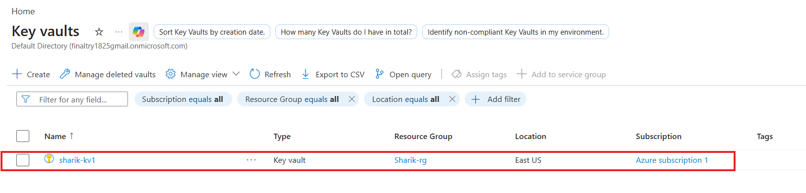
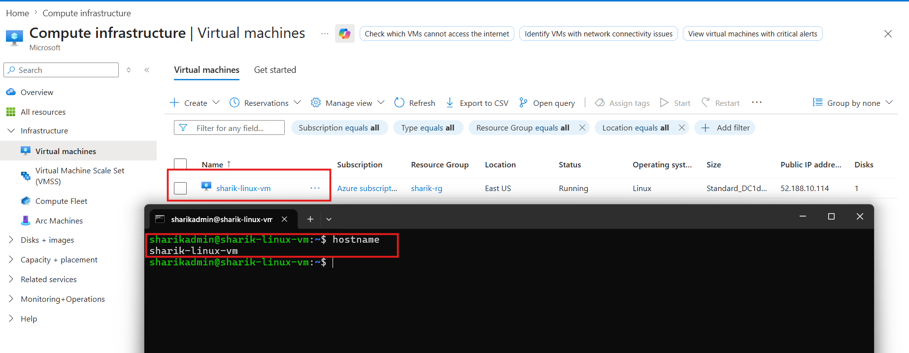

# 🚀 Azure Linux VM Deployment with Azure Key Vault


---

## Overview

This project uses Terraform to deploy a secure Linux Virtual Machine on Microsoft Azure by fetching the VM password securely from Azure Key Vault.

This project uses **Terraform** to deploy a **Linux Virtual Machine (VM)** on Microsoft Azure.

The main highlight of this project is that the VM password is **securely fetched from Azure Key Vault** instead of being directly written in the Terraform code.

---

## 🛡️ Why Use Azure Key Vault?

Azure Key Vault is used to keep sensitive information secure.

If we write the VM password directly inside the Terraform code (`main.tf`), anyone who can access the code can see it.

By using **Azure Key Vault**:

- The password stays secure
- It is fetched only during deployment
- It is never hardcoded in the Terraform files

This follows a **secure and professional infrastructure deployment practice**.

---

## 🏗️ Architecture Components

- This setup uses the following Azure resources:

### **Resource Group (RG)**
- A container that holds all related Azure resources together.

### **Virtual Network (VNet)**
- A private cloud network where resources can communicate securely.

### **Subnet**
- A smaller section inside the Virtual Network used for better network organization.

### **Network Security Group (NSG)**
- Acts like a firewall to control incoming and outgoing traffic (for example, allowing SSH on Port 22).

### **Public IP**
- Allows access to the VM from the internet.

### **Network Interface (NIC)**
- Connects the Virtual Machine to the network.

### **Azure Key Vault**
- Securely stores secrets like passwords, keys, and certificates.

### **Linux Virtual Machine**
- The main cloud server created for deployment and testing.

---

## 🛠️ Prerequisites

Before running this project, make sure the following resources are already created in Azure Portal:

### **1. Create Key Vault**
Create a Key Vault with the name:  Note - (any name it's depend on you)

`sharik-kv1`

### **2. Create Secret**
Inside the Key Vault, create a secret named: Note - (any name it's depend on you) 

`vm-pswrd`

Store your VM password inside this secret.

### **3. Assign Permissions**
Assign your account the following role:

**Key Vault Secrets Officer**

This allows Terraform to read the secret during deployment.



---

## 💻 Step-by-Step Implementation

Now we will write the Terraform code that fetches the password from Azure Key Vault and creates the Linux Virtual Machine.

---

### **1. Folder Structure**

First, create a project folder on your system and add the following files:

- **variables.tf** → Used to store all configuration values  
- **main.tf** → Used to define the infrastructure resources

---

### **2. Configuration Files**

#### **variables.tf**
This file contains the names of:

- Resource Group
- Azure Key Vault
- Secret name

This makes the code reusable and easy to manage.

#### **main.tf**
This file contains all the infrastructure resources in a proper logical order:

**Resource Group → Network → NSG → Virtual Machine**

It also uses a **Terraform data block** to fetch the password securely from Azure Key Vault.

---

### **3. Deployment Commands**

Run the following commands one by one in your terminal:

#### **Initialize Terraform**

```bash
terraform init
```

This downloads and initializes the required Terraform providers.

---

#### **Verify the Deployment Plan**

```bash
terraform plan
```

This shows the changes Terraform will make before deployment.

---

#### **Deploy the Infrastructure**

```bash
terraform apply -auto-approve
```

This creates all the Azure resources automatically.




---

### **4. What Happens During Deployment**

When the deployment starts:

- Terraform connects to Azure
- Reads the secret from Azure Key Vault
- Creates the network resources
- Deploys the Linux Virtual Machine
- Configures the VM using the secure password

**This ensures a secure and automated deployment process**.

## 📝 Project Learnings

Through this project, I learned:

- Secure password management using Azure Key Vault
- Zero hardcoding approach for sensitive data
- Using Terraform data blocks to fetch existing Azure resources
- Professional resource dependency and ordering in Terraform
- Infrastructure as Code (IaC) best practices

---

## 🎯 Key Takeaway

This project demonstrates how to deploy Azure infrastructure securely using Terraform while following cloud security best practices.

It shows how to integrate **Terraform + Azure Key Vault** for secure and production-ready deployments.