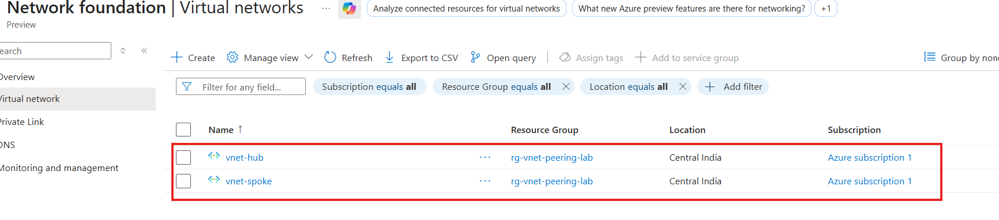
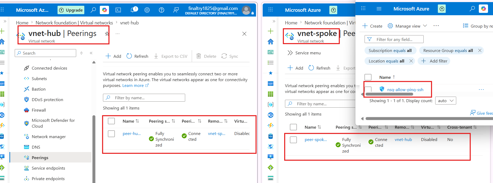
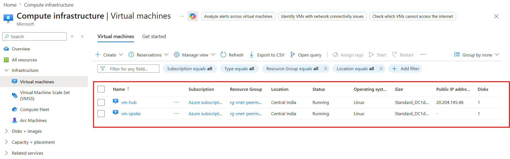
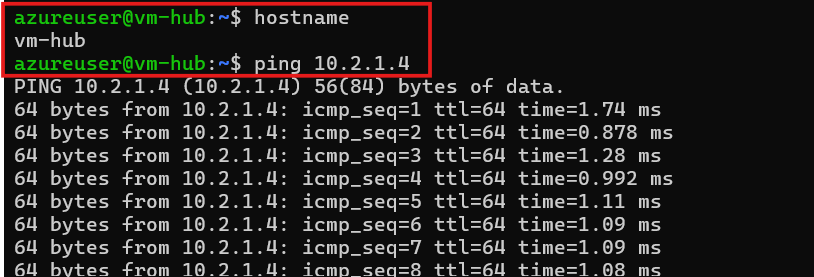
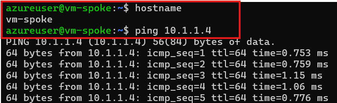

# 🌐 Azure Regional VNet Peering via Terraform

---

## 📌 What is Regional VNet Peering?

Regional VNet Peering connects two different Virtual Networks (VNets) within the same Azure region. It allows resources in both networks to communicate with each other securely using private IP addresses, completely bypassing the public internet.

---

## 💡 The Core Logic (How it Works)

To keep this lab secure and professional, we use a Hub-Spoke design:

1. **VM-A (The Entry Point / Hub VM):** This VM has a **Public IP** so we can securely log in from our laptop.
2. **VM-B (The Isolated Server / Spoke VM):** This VM has **NO Public IP**. It is completely locked and hidden from the   - - internet like a locker (Tijori).
3. **VNet Peering (The Key):** This is the bridge that allows VM-A to talk directly to VM-B using its private network.

---

### Why this design?

* It proves you understand the difference between **Public vs Private IPs**.
* It shows you know **Cloud Security** (never expose backend servers to the open internet).
* It proves you **actually tested** the peering via private IP pings.

---

## 🛠️ Step-by-Step Implementation

### 📂 Step 1: Base Configuration Files

- First, we create 3 core files to build our basic cloud foundation:

* **`providers.tf`** - Configures the basic Azure provider block to connect Terraform with your Azure account.
* **`variables.tf`** - Defines the region (Location) and CIDR address blocks for both networks to avoid hardcoding.
* **`main.tf`** - Creates the Azure Resource Group and both Virtual Networks (Hub VNet & Spoke VNet) using variables.

---

### 📂 Step 2: Networking & Security Files

- Next, we create 3 more files to handle subnets, connection paths, and security rules:

* **`subnet.tf`** - Creates one subnet inside each VNet so our Virtual Machines have a place to sit.
* **`peering.tf`** - Establishes the connection between both VNets. *Remember: Peering must always be configured Two-Way (Hub-to-Spoke and Spoke-to-Hub) for traffic to flow.*
* **`nsg.tf`** - By default, Azure blocks internal ping traffic. We create a Network Security Group (NSG) to explicitly allow SSH and ICMP (Ping) traffic.

---

### 📂 Step 3: Virtual Machines File

- Finally, we create a separate file to deploy our test compute resources:

* **`vms.tf`** - Contains the complete code for deploying both Linux VMs, their Network Interfaces (NICs), and associates them with our NSG rules.

---

## 🧪 Step-by-Step Verification (Bidirectional Ping Test)

### Step 1: Log in to the Hub VM (VM-A)

Open your laptop's terminal and connect to the Hub VM using its Public IP:
bash
**ssh azureuser@<HUB_VM_PUBLIC_IP>**

### 🔥TEST 1: Ping from Hub to Spoke (VM-A -> VM-B)

- Inside the Hub VM terminal, run a ping test to the Spoke VM's Private IP (10.2.1.4):

---

### 🔥TEST 2: Ping from Spoke to Hub (VM-B -> VM-A)

- Since the Spoke VM has no Public IP, we will jump into it from the Hub VM first, then ping back:

---

**If both pings are successful, your Two-Way Regional VNet Peering is working perfectly!**

---

## 🎯 Key Takeaways & Interview Highlights

* **Backbone Routing:** Traffic between VNets travels securely over the private Microsoft Azure backbone network, never touching the public internet.
* **Zero-Trust Security:** Demonstrates secure architecture by keeping backend servers (Spoke VM) hidden with no Public IPs, using a Jumpbox (Hub VM) for secure access.
* **Infrastructure-as-Code (IaC):** 100% automated infrastructure setup, showcasing modularization by splitting networking, security, and compute into clear, separate `.tf` files.

---
