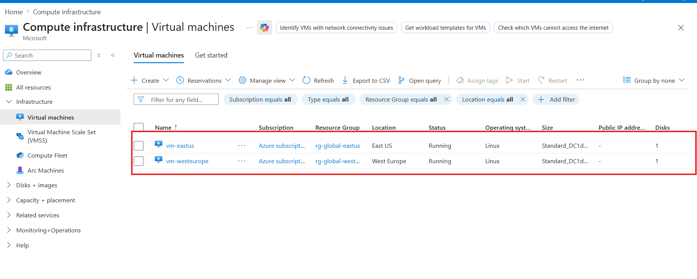
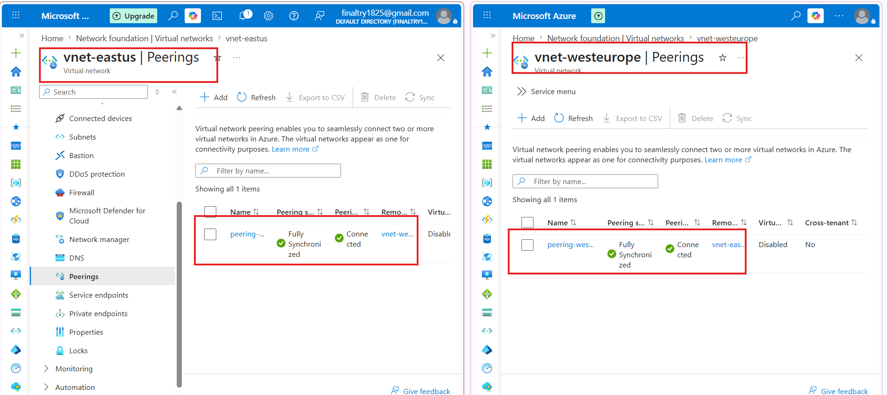

# 🌍 Azure Global VNet Peering (Terraform Project)

 

 

---

# 📌 What is Global VNet Peering?

Global VNet Peering allows two Virtual Networks in different regions to communicate with each other using private IP addresses.
It uses Azure’s backbone network, making the connection secure, fast, and reliable.

---

## 🏗️ Infrastructure Setup

**We deployed infrastructure in two different regions:**

- East US
- West Europe

**Each region includes:**

- Virtual Network (VNet)
- Subnet
- Network Security Group (NSG)
- Network Interface (NIC)
- Virtual Machine (VM)

---

### 🔗 Global VNet Peering Configuration

- Established peering between both VNets
- Configured bi-directional connection
- Verified that peering status is Connected

---

## 🧪 Connectivity Testing

**🔹 Step 1: Connect to East US VM**

- Use SSH to connect from your local machine:

    ssh azureuser@<YOUR_PUBLIC_IP>

**🔹 Step 2: Ping West Europe VM (from East US)**

- Run the following command using private IP:

- ping <WEST_EUROPE_PRIVATE_IP>

---

### 🔹 Step 3: Reverse Testing (West Europe → East US)

- Login into West Europe VM
- Connect to East US VM using private IP:

- ssh azureuser@<EAST_US_PRIVATE_IP>

**Then run ping**:

- ping <EAST_US_PRIVATE_IP>

---

## ✅ Conclusion

- Global VNet Peering successfully connects VNets across regions
- Communication happens over private IPs only
- Low latency and secure connection using Azure backbone

---

**🚀 Future Enhancements**

- Add Azure Bastion for secure access
- Implement stricter NSG rules
- Integrate CI/CD using
- GitHub Actions
- Azure DevOps
- Add monitoring (Azure Monitor)

---