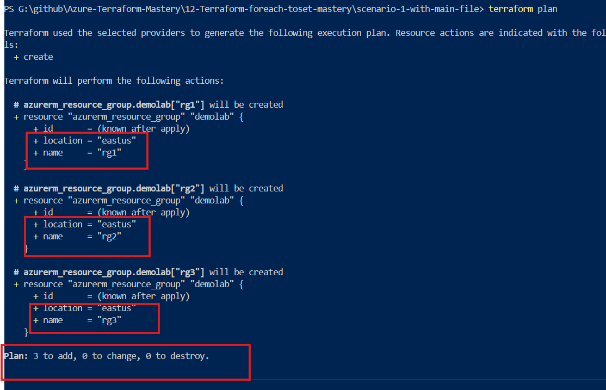
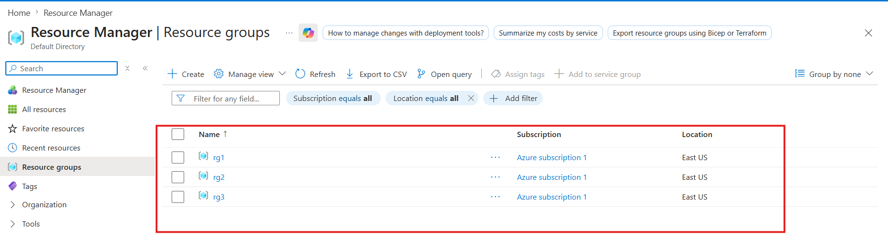
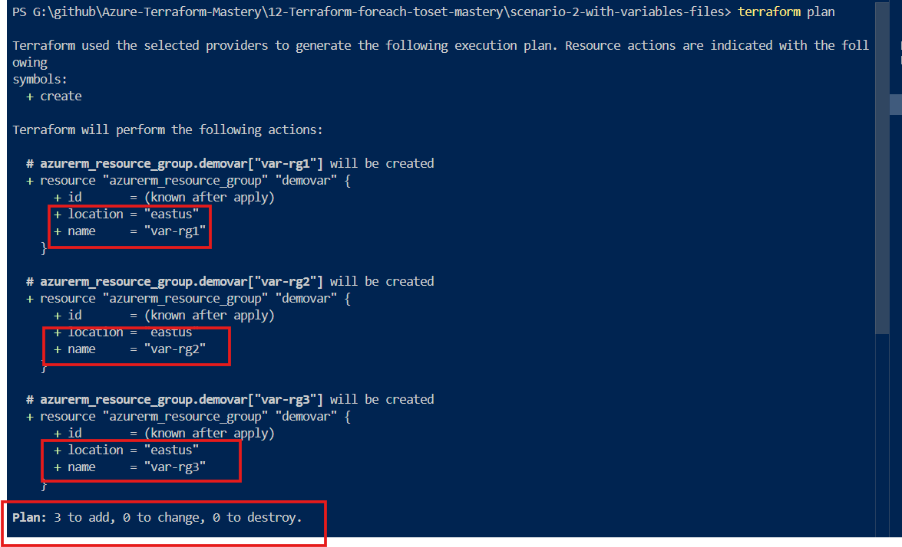
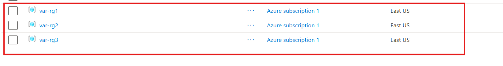
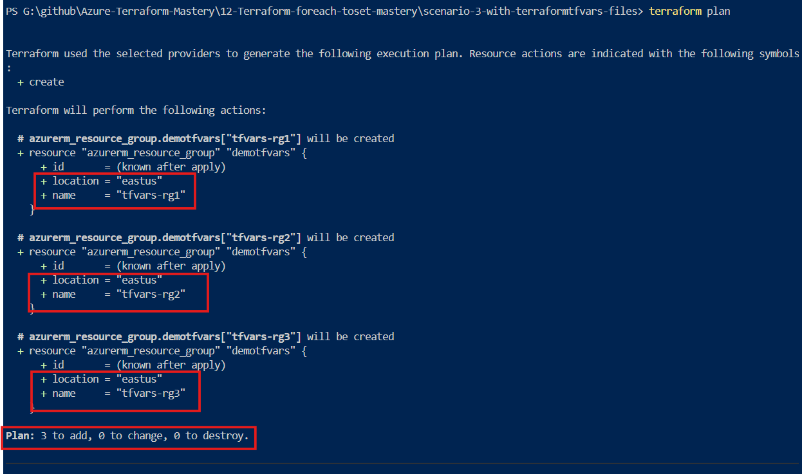
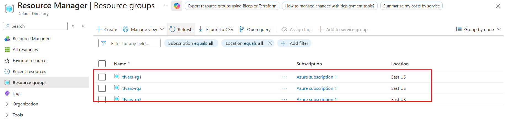

# 🚀 Terraform toset() – Complete Guide with Practical Scenarios


---

## 📌 Project Overview

This project explains how to use the toset() function in Terraform to create multiple Azure Resource Groups efficiently.

**We implemented the same use case in 3 different ways**:

- Hardcoded approach
- Using variables.tf
- Using terraform.tfvars (Best Practice)

👉 The goal is to understand how Terraform code evolves from:

  **Basic → Reusable → Production-ready**

---


### 🔷 What is toset() in Terraform?

toset() is a type conversion function in Terraform that converts a list into a set.

👉 “toset() is best used when all resources share identical properties (such as location, tags, or size), and only their names or unique identifiers differ.”

- 🔥 Key Properties of Set
- ❌ No duplicate values
- ❌ Unordered (no fixed sequence)
- ✅ Only unique values are allowed

**👉 Example**:

- toset(["rg1", "rg2", "rg1"])

**✔ Output**:

- ["rg1", "rg2"]

---

### ❓ Why do we use toset()?

- To avoid duplicate resource creation
- To ensure unique values
- To simplify for_each loops

---

### 🔁 each.key vs each.value

When using toset() with for_each:

**👉 Internally:**

```hcl
{
  "rg1" = "rg1",
  "rg2" = "rg2"
}
```

**✔ That’s why**:

- each.key == each.value
- You can use either one
- No difference in output

---

## 🧪 Scenario 1: Hardcoded Approach

### 📌 Why we used this?

**👉 To understand the basic working of Terraform + toset() without complexity**.

**🧾 Code**

```hcl
resource "azurerm_resource_group" "rg" {
  for_each = toset(["rg-dev", "rg-test", "rg-dev"])

  name     = each.value
  location = "East US"
}
```

### ⚙️ What happens?

- Duplicate values removed
- Only unique Resource Groups created

**⚠️ Problem**

- ❌ Not reusable
- ❌ Need to edit code again and again
- ❌ Not suitable for real projects

---

### 🖥️ Scenario 1: Output Verification

**Terraform Plan Output**:



---

**Azure Portal Verification**:



---

## 🧪 Scenario 2: Using variables.tf

### 📌 Why we used this?

👉 To separate data from code so we can reuse the same logic.

**📁 Files** 

- main.tf → Logic
- variables.tf → Input data

---

**🧾 variables.tf**

```hcl
variable "rg_names" {
  type = list(string)
}
```
---

**🧾 main.tf**

```hcl
resource "azurerm_resource_group" "rg" {
  for_each = toset(var.rg_names)

  name     = each.value
  location = "East US"
}
```

---

**✅ Benefits**

- Code becomes clean
- Easy to reuse
- No need to hardcode values

**⚠️ Still a limitation**

- Need to pass values manually

---

### 🖥️ Scenario 2: Output Verification

**Terraform Plan Output**:



---

**Azure Portal Verification**:



---

## 🧪 Scenario 3: Using terraform.tfvars

### 📌 Why we used this?

👉 To fully separate:

- Variable definition
- Actual values

**So we can switch environments easily (Dev / Stage / Prod)**

---

### 📁 Files

- variables.tf → Only structure
- terraform.tfvars → Real values
- main.tf → Logic

---

**🧾 terraform.tfvars**

```hcl
 rg_names = ["rg-dev", "rg-stage", "rg-prod"]
 
 ```

---

### ⚙️ How it works

- Terraform automatically reads this file
- No need to pass inputs manually

---

### 🔥 Benefits

- No code change required
- Easy environment switching
- Industry best practice

---

### 🖥️ Scenario 3: Output Verification

**Terraform Plan Output**:



---

**Azure Portal Verification**:



---

## 📊 Comparison Table

<p align="center">

| 🚀 Feature | 🧱 Scenario 1 (Hardcoded) | ⚙️ Scenario 2 (variables.tf) | 🌍 Scenario 3 (tfvars) |
|-----------|--------------------------|-----------------------------|------------------------|
| 🎯 **Why used** | 🟡 Learn basics quickly | 🔵 Separate data from code | 🟢 Manage environments easily |
| 🔄 **Flexibility** | 🔴 Very Low | 🟠 Medium | 🟢 High |
| ♻️ **Reusability** | 🔴 No | 🟢 Yes | 🟢 Best |
| 🛠️ **Code changes needed** | 🔴 Every time | 🟠 Sometimes | 🟢 No |
| 🌐 **Environment support** | 🔴 No | 🟠 Limited | 🟢 Full (Dev/Prod) |
| 🏢 **Real-world usage** | 🔴 Not used | 🟠 Beginner level | 🟢 Industry standard |

</p>

---

## 🧠 Quick Understanding

- 🔴 **Hardcoded** → Good for learning, bad for real projects  
- 🟠 **variables.tf** → Better structure, but still not fully flexible  
- 🟢 **terraform.tfvars** → Best practice, used in real DevOps environments  

---

## 🏆 Final Verdict

> ✅ Always prefer **Scenario 3 (tfvars)** for real-world projects  
> because it gives **clean code + flexibility + environment control**

---

## 🔥 Pro Tip

💡 In real projects:
- Use **multiple `.tfvars` files** → `dev.tfvars`, `prod.tfvars`
- Combine with **modules + for_each + toset()**
- Keep your code **clean, reusable, and scalable**

---

