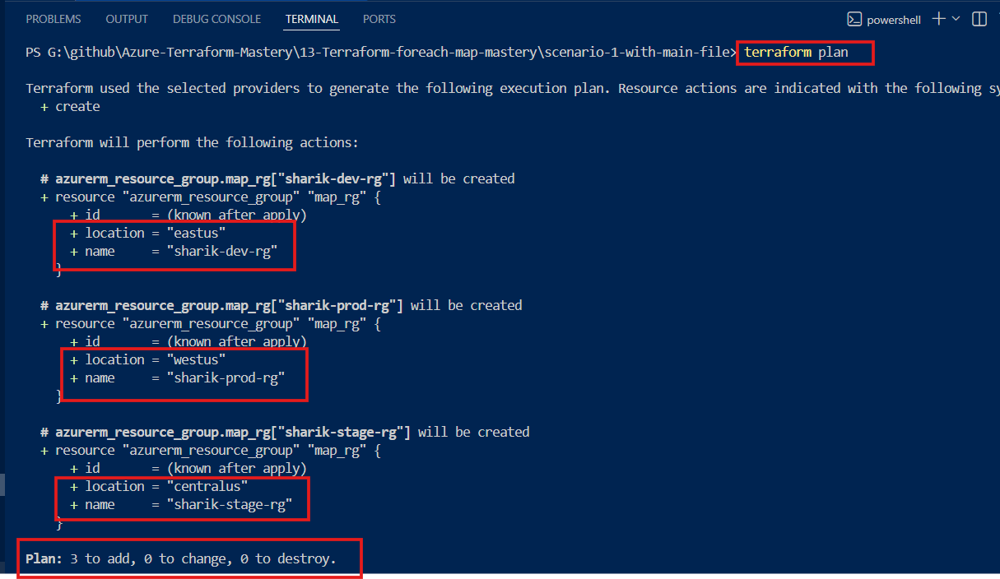
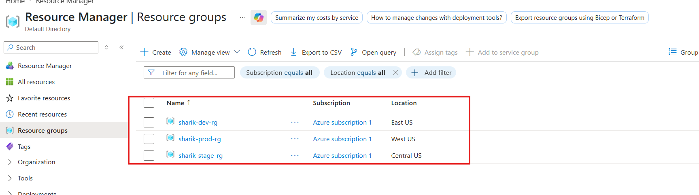
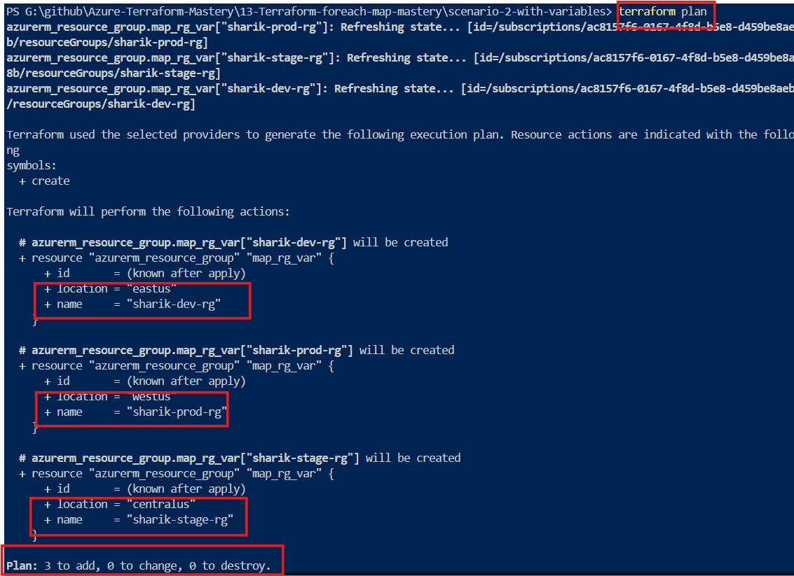
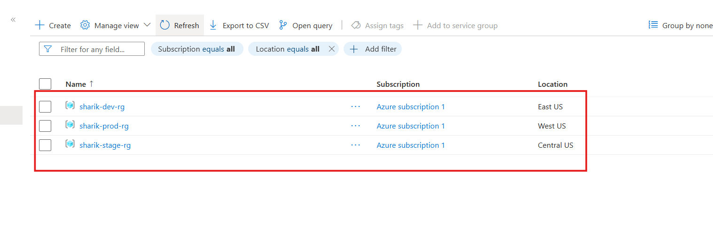
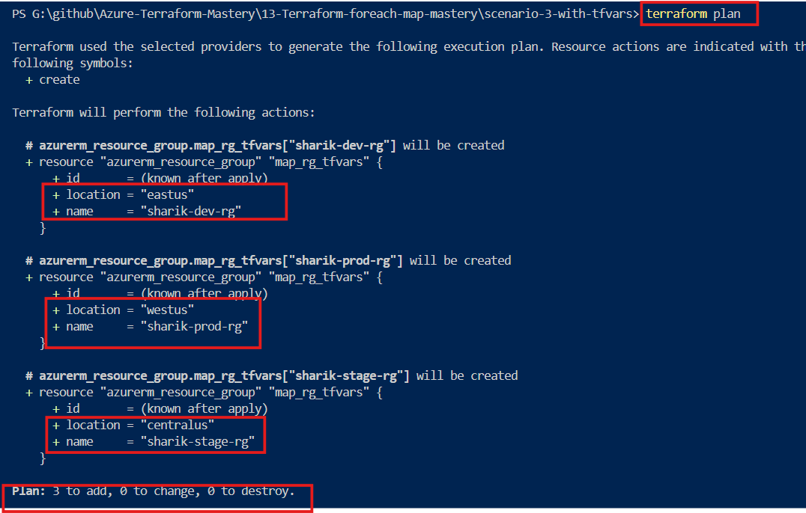
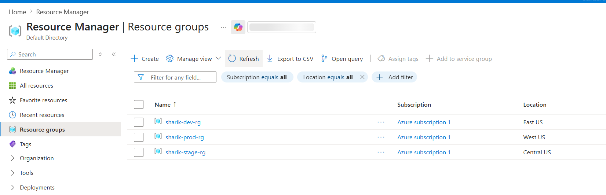

# 📘 Terraform for_each with Map 

  
  
  
  

  
  
  
  

  
  

---

This explains how to use for_each with map in Terraform step by step, with real examples.

---

## 🚀 What is for_each with Map?

A map is a collection of key-value pairs where each key is unique and is used to access its corresponding value.

The `for_each` argument in Terraform allows us to create multiple resources by iterating over a collection such as a map or set.

When we use a map with `for_each`, we can dynamically create resources with different configurations, such as name and region.

In this case:
- `each.key` represents the resource name
- `each.value` represents the resource configuration (e.g., location)

---

## 🤔 Why Map when toset() already works?

**toset() case**:
 - ["rg1", "rg2"]

**👉 Problem**:

- Only names available
- No extra data (like region)

---

## ✅ Map case:

{
  "rg1" = "East US"
  "rg2" = "West US"
}

**👉 Advantage**:

- Name + Location both available
- More flexible and real-world usage

---

## 🧠 Understanding each.key and each.value

| Term         | Meaning                 |
| ------------ | ----------------------- |
| `each.key`   | Map key (Resource Name) |
| `each.value` | Map value (Location)    |

---

## 🧪 Scenario 1: Hardcoded Map in main.tf

**📌 Purpose**:

- Everything in one file (simple testing)

resource "azurerm_resource_group" "map_rg" {
  for_each = {
    "sharik-dev-rg"   = "East US"
    "sharik-stage-rg" = "Central US"
    "sharik-prod-rg"  = "West US"
  }

  name     = each.key
  location = each.value
}
---

## 🔄 How Loop Works (Behind the Scenes)

| Loop | each.key        | each.value |
| ---- | --------------- | ---------- |
| 1    | sharik-dev-rg   | East US    |
| 2    | sharik-stage-rg | Central US |
| 3    | sharik-prod-rg  | West US    |

---

### 🖥️ Scenario 1: Output Verification

**Terraform Plan Output**:

---

**Azure Portal Verification**

---

## 🧪 Scenario 2: Using variables.tf

**📌 Purpose**:

- Separate data from code (best practice)

**📁 variables.tf**

variable "rg_environments" {
  type        = map(string)
  description = "RG Name -> Location"

  default = {
    "sharik-dev-rg"   = "East US"
    "sharik-stage-rg" = "Central US"
    "sharik-prod-rg"  = "West US"
  }
}
---
**📁 main.tf**

resource "azurerm_resource_group" "map_rg_var" {
  for_each = var.rg_environments

  name     = each.key
  location = each.value
}
---

## 🔄 How Loop Works Behind the Scenes

- Even though the data is coming from `variables.tf`, the loop works exactly like Scenario 1.

| Loop | each.key           | each.value  |
|------|------------------|------------|
| 1    | sharik-dev-rg    | East US    |
| 2    | sharik-stage-rg  | Central US |
| 3    | sharik-prod-rg   | West US    |

**At each iteration**:

- `each.key` becomes the Resource Group name  
- `each.value` becomes the location  

- So Terraform creates all Resource Groups in different regions without any error.

---

### 🖥️ Scenario 2: Output Verification

**Terraform Plan Output**:

---

**Azure Portal Verification**

---

## 🧪 Scenario 3: Using terraform.tfvars

**📌 Purpose**:

The main goal of this scenario is to keep only the **structure (skeleton)** in `variables.tf`  
and store the **actual data** in `terraform.tfvars`.

This helps us to:

- Change environments easily  
- Avoid modifying main code  
- Deploy infrastructure in different regions just by changing `.tfvars` file  

---

**📁 terraform.tfvars (Actual Data)**

rg_environments = {
  "sharik-dev-rg"   = "East US"
  "sharik-stage-rg" = "Central US"
  "sharik-prod-rg"  = "West US"
}
---

## 🔄 How Loop Works Behind the Scenes

- Even though the data is coming from terraform.tfvars,
- the loop works exactly the same as previous scenarios.

| Loop | each.key        | each.value |
| ---- | --------------- | ---------- |
| 1    | sharik-dev-rg   | East US    |
| 2    | sharik-stage-rg | Central US |
| 3    | sharik-prod-rg  | West US    |

**At each iteration**:

- each.key becomes the Resource Group name
- each.value becomes the location

---

### 🖥️ Scenario 3: Output Verification

**Terraform Plan Output**:

---

**Azure Portal Verification**

---

### 🧠 Behind the Flow (Simple Understanding)

- Terraform reads main.tf
- Finds var.rg_environments
- Checks its type in variables.tf
- Loads actual values from terraform.tfvars
- Runs loop using for_each

---

### 💯 Key Benefit

**You can change regions or add new environments (like QA, UAT)**

**by updating only the terraform.tfvars file — no need to touch the main code**.

---

### 💯 Key Takeaways

- toset() → simple list (limited use)
- map → real-world flexible solution
- each.key → resource name
- each.value → configuration value
- Best practice → use variables + tfvars

---
