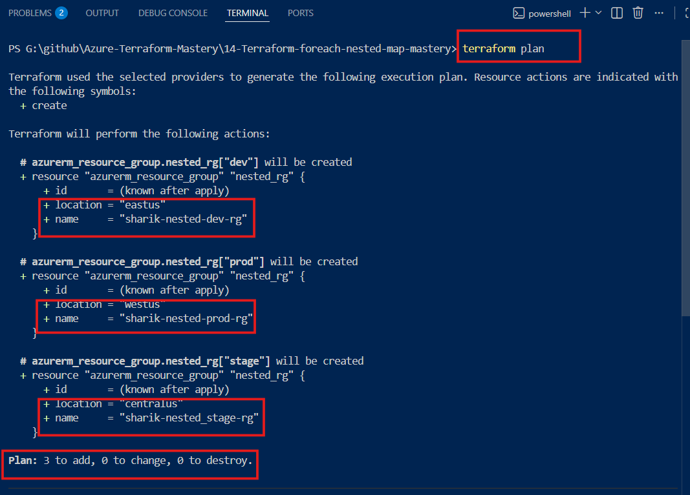
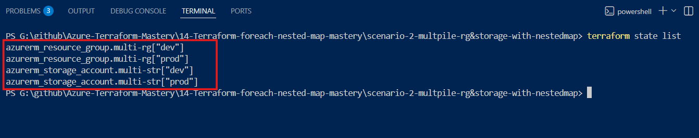

# 🚀 Terraform Nested Map – Simple Explanation


---

## 🤔 What is Nested Map?

A nested map means:

A map inside another map (or map of objects)
It helps you store multiple related values together

**👉 Example**:

- Instead of writing separate variables like:

- name
- location

**You bundle them together in one object**.

---

## ❓ Why use Nested Map when Map was already working?

**Earlier**:

- map(string) → only 1 value per key

**Now**:

- map(object) → multiple values per key

**👉 So**:

- If you need only one value → use map(string)
- If you need multiple values → use map(object)

---

### 🔹 Scenario 1: Create Multiple Resource Groups (dev, stage, prod)

**📁 main.tf**

```hcl
resource "azurerm_resource_group" "nested_rg" {
  for_each = var.environment_configuration

  name     = each.value.resource_group_name
  location = each.value.location
}
```
---

**📁 variable.tf**

```hcl
variable "environment_configuration" {
  type = map(object({
    resource_group_name = string
    location            = string
  }))
  description = "Map of Objects containing environment specific Resource Group details"
}
```
---

**📁 terraform.tfvars**

```hcl
  dev = {
    resource_group_name = "sharik-nested-dev-rg"
    location            = "east us"
  }

  prod = {
    resource_group_name = "sharik-nested-prod-rg"
    location            = "west us"
  }

  stage = {
    resource_group_name = "sharik-nested_stage-rg"
    location            = "Central US"
  }
}
```
---

# ⚙️ How Terraform Works Internally (Step-by-Step)

### 🛠️ Step 1: Load & Validate Data

- Terraform reads variables.tf and terraform.tfvars
- It checks:
- Type = map(object)
- Required fields exist (resource_group_name, location)
- If everything matches → ✅ No error

---

### 🔄 Step 2: for_each Loop Execution

- Terraform breaks map into 3 iterations

---

**🔄 Iteration 1 (Dev)**

- each.key = "dev"
- each.value:

```hcl
{
  resource_group_name = "sharik-nested-dev-rg"
  location = "East US"
}
```
**👉 Dot operator**:

- each.value.resource_group_name → "sharik-nested-dev-rg"
- each.value.location → "east us"

**👉 Resource created**:

```hcl
azurerm_resource_group.nested_rg["dev"]
```
---

**🔄 Iteration 2 (Prod)**

- each.key = "prod"
```hcl
{
  resource_group_name = "sharik-nested-prod-rg"
  location = "west US"
}
```
**👉 Resource created**:
```hcl
azurerm_resource_group.nested_rg["prod"]
```
---

**🔄 Iteration 3 (Stage)**

- each.key = "stage"
```hcl
{
  resource_group_name = "sharik-nested_stage-rg"
  location = "Central US"
}
```
**👉 Resource created**:
```hcl
azurerm_resource_group.nested_rg["stage"]
```
---

### 📊 Step 3: Terraform Plan Output



---

### 💡 Biggest Advantage

**👉 If you remove stage from .tfvars**:

- Only "stage" resource will be deleted
- dev and prod stay untouched ✅

---

### 🎯 Key Concept

**👉 Dot operator (.)**:

- Used to extract values from object

Example:
```hcl
each.value.location
```
---

# 🚀 Scenario 2: Multi Resource (RG + Storage Account)

### 📌 Goal

**Use same nested map to**:

- Create Resource Group
- Create Storage Account inside it

---

**📁 main.tf**

```hcl
resource "azurerm_resource_group" "multi-rg" {
  for_each = var.multi-rg_storage_accounts
  name     = each.value.resource_group_name
  location = each.value.location
}

resource "azurerm_storage_account" "multi-str" {
  for_each = var.multi-rg_storage_accounts

  name                     = each.value.name
  location                 = each.value.location
  resource_group_name      = azurerm_resource_group.multi-rg[each.key].name
  account_tier             = each.value.account_tier
  account_replication_type = each.value.account_replication_type
}
```
---

**📁 variable.tf**

```hcl
variable "multi-rg_storage_accounts" {
}
```
---

**📁 terraform.tfvars**

```hcl
multi-rg_storage_accounts = {
  dev = {
    resource_group_name = "sharik-rg-dev"
    location = "east us"
    name = "sharikdevstr01"
    account_tier = "Standard"
    account_replication_type = "LRS"
  }

  prod = {
    resource_group_name = "sharik-rg-prod"
    location = "east us"
    name = "sharikprodstr02"
    account_tier = "Standard"
    account_replication_type = "LRS"
  }
}
```
---

# ⚙️ How Terraform Works (Scenario 2)

### 🗺️ Step 1: Dependency Graph

- Terraform sees:
```hcl
azurerm_resource_group.multi-rg[each.key].name
```

**👉 So it understands**:

- Storage Account depends on Resource Group

---

### 🔄 Step 2: Resource Group Creation

**Dev**:
```hcl
azurerm_resource_group.multi-rg["dev"]
```

**prod**:
```hcl
azurerm_resource_group.multi-rg["prod"]
```
---

### ⛓️ Step 3: Storage Account Creation

**Dev**:

- each.key = "dev"
- Name = "sharikdevstr01"

**👉 Important**:
```hcl
azurerm_resource_group.multi-rg["dev"].name
```
- 👉 Terraform fetches RG name dynamically

**👉 Result**:

- Storage waits until RG is created ✅
---

**Prod**:

- each.key = "prod"

**👉 Same linking**:
```hcl
azurerm_resource_group.multi-rg["prod"].name
```
---

### Terraform Output 



---

**🔥 Final Understanding**

- 👉 One loop → multiple resources
- 👉 One key (dev, prod) → linked resources
- 👉 Automatic dependency handling

---
