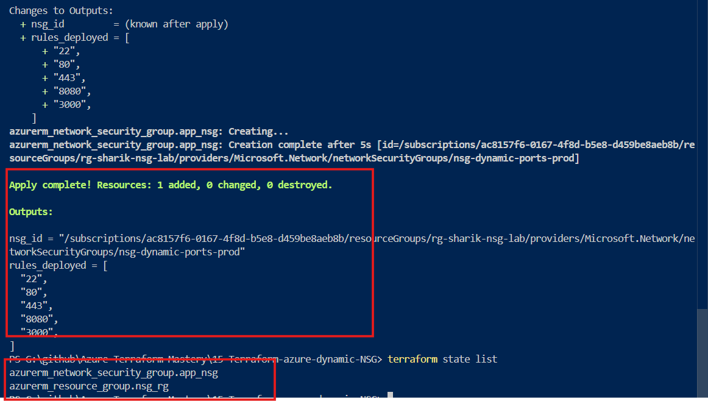
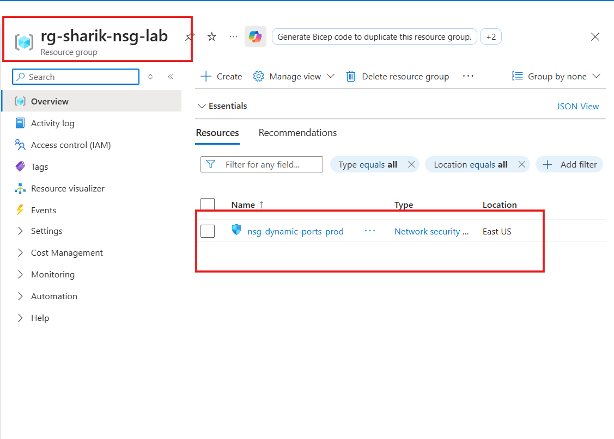

# Azure NSG Automation using Terraform Dynamic Blocks


---

## 📌 What is an NSG (Network Security Group)? 

An **NSG (Network Security Group)** works like a digital security guard or a firewall for your cloud network. It contains a list of security rules that can allow or block network traffic coming into or going out of your Azure resources (like Virtual Machines).

---

### ⏱️ When do we make it and Why?

* **When:** We create an NSG as soon as we set up our cloud network or deploy an application server (like a React App or a Database).

* **Why:** By default, Azure blocks all outside traffic to keep things safe. We create an NSG to open only the specific doors (ports) our application needs to run, keeping all other doors permanently locked from hackers.

---

## ⚡ What is a Dynamic Block?

In standard Terraform, if you want to open 5 different ports, you have to copy and paste the same 15-line security rule block 5 times. This makes your code long and messy.

A **Dynamic Block** acts like a `for-each` loop inside Terraform. It allows us to write the security rule block just **once**, and it automatically loops through a list of ports to create all the rules for us.

---

## 🛠️ File Architecture

To keep this project easy to learn and understand, everything is managed inside a single file:
* `main.tf` - Contains the entire infrastructure configuration, variables, logic, and outputs.

---

## 🚀 How to Run this Lab Locally

### Prerequisites

1. **Terraform CLI** installed on your local machine.
2. **Azure CLI** installed and authenticated (`az login`).

### Deployment Steps

1. Open your terminal inside the project folder.
2. Run the initialization command:
   
```bash
   terraform init
   ```
---
**Check the deployment plan**:
```bash
terraform plan
```
---

**Apply the configuration to create resources in Azure**:
```bash
terraform apply --auto-approve
```
---
**To delete the resources after testing**:
```bash
terraform destroy --auto-approve
```
---

## 📸 Deployment Verification & Proof of Work

### 1. Terminal Execution (Terraform Apply Success)

Below is the terminal snapshot showing the successful execution of `terraform apply`. You can see that **2 resources** were successfully added and the outputs printed the unique Azure Resource ID along with the list of deployed ports.

---



---

### 2. Azure Portal Verification (Dynamic Rules Live)

This snapshot from the Azure Portal confirms that the Network Security Group (`nsg-dynamic-ports-prod`) was created successfully. Notice how the **Dynamic Block loop** automatically generated individual inbound security rules for each port (`22`, `80`, `443`, `8080`, `3000`) and sequentially mapped their priorities (`100`, `101`, `102`...) without any manual conflict.

---



---


# 📝 Code Breakdown (Block by Block)

## Block 1: Terraform Settings & Provider Configuration
```bash
terraform {
  required_providers {
    azurerm = {
      source  = "hashicorp/azurerm"
      version = "4.73.0" 
    }
  }
}

provider "azurerm" {
  features {}
}
```
---

**Why we use it**:

 Terraform is a universal tool that works with AWS, Azure, and Google Cloud. We need this block to tell Terraform explicitly that we want to connect with Microsoft Azure.

**How it works**: 

The terraform {} block downloads the official Azure plugin (azurerm) from HashiCorp. The provider "azurerm" {} block connects with your local Azure CLI login session to execute commands.

---

## Block 2: Local Variables (locals)
```bash
locals {
  resource_group_name = "rg-sharik-nsg-lab"
  location            = "East US"
  nsg_name            = "nsg-dynamic-ports-prod"
  
  ports_to_open       = ["22", "80", "443", "8080", "3000"]
}
```
---

**Why we use it**: 

To avoid hardcoding names and ports inside the actual resource code. If we need to change a name or add a port later, we only change it here in one place.

**How it works**: 

This block acts as a central control dashboard. The ports_to_open list holds all our network ports. If you want to open a new port (like 9000), you simply append it to this array.

---

## Block 3: Azure Resource Group (azurerm_resource_group)
```bash
resource "azurerm_resource_group" "nsg_rg" {
  name     = local.resource_group_name
  location = local.location
}
```
---
**Why we use it**: 

In Azure, every service must live inside a Resource Group. You can think of it as a logical container or a folder where all related cloud resources are stored.

**H**ow it works**:

 It creates a new Resource Group named rg-sharik-nsg-lab in the East US region by pulling the values directly from our locals block.

 ---

 ## Block 4: Core Logic - NSG with Dynamic Block
 ```bash
 resource "azurerm_network_security_group" "app_nsg" {
  name                = local.nsg_name
  location            = azurerm_resource_group.nsg_rg.location
  resource_group_name = azurerm_resource_group.nsg_rg.name

  dynamic "security_rule" {
    for_each = local.ports_to_open
    content {
      name                       = "Allow-Port-${security_rule.value}"
      priority                   = 100 + index(local.ports_to_open, security_rule.value)
      direction                  = "Inbound"
      access                     = "Allow"
      protocol                   = "Tcp"
      source_port_range          = "*"
      destination_port_range     = security_rule.value
      source_address_prefix      = "*"
      destination_address_prefix = "*"
    }
  }

  tags = {
    Environment = "Production"
    ManagedBy   = "Terraform"
  }
}
```
---
**Why we use it**:

 This is the main engine of the project. Instead of writing 5 separate rule blocks for our 5 ports, we use a loop to keep the code short, clean, and professional.

**How it works**:

`dynamic "security_rule"` triggers the internal loop window.

`for_each` tells the loop to run exactly 5 times because we have 5 items in our port list.

`priority = 100 + index(...)` automatically assigns a unique priority number (100, 101, 102...) to each port so they never conflict with one another.

`destination_port_range` assigns the actual port number from the array list during each iteration.

---

## Block 5: Outputs (output)
```bash
output "nsg_id" {
  value       = azurerm_network_security_group.app_nsg.id
  description = "The Resource ID of the newly created NSG"
}

output "rules_deployed" {
  value       = local.ports_to_open
}
```
---
**Why we use it**: 

When Terraform finishes running, we want to see the deployment results immediately on our command screen instead of checking the Azure Portal manually every time.

**How it works**:

 It prints the final Azure resource ID of the NSG and lists all the successfully deployed ports directly onto your terminal window in green text.

 ---
 
 ---

# 🔑 Key Takeaways

- 🚀 Learned how to use **Terraform Dynamic Blocks** to eliminate repetitive code
- 🔁 Implemented **for_each loop inside infrastructure code** for automation
- ⚡ Reduced manual effort by generating multiple NSG rules from a single block
- 🧠 Understood **Azure NSG architecture and security rule priorities**
- 🛡️ Followed **least privilege principle** by opening only required ports
- 📉 Improved code maintainability and scalability using **locals and variables**
- 🏗️ Built a clean and production-ready **Infrastructure as Code (IaC) project**
- 🎯 Demonstrated real-world **DevOps automation use-case**

---
