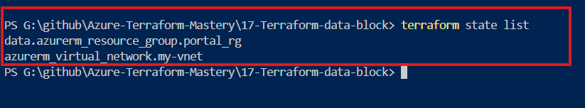

# Demystifying Terraform Data Blocks (Data Sources) 🚀


---

Welcome to this hands-on lab where we explore the concept of **Data Blocks** in Terraform. This lab is designed to be simple, clean, and contained within a single `main.tf` file for easy understanding and quick deployment.

---

## 📌 What is a Data Block?

In Terraform, a `data` block (also known as a **Data Source**) is used to **fetch or read information** from resources that already exist in your cloud infrastructure (Azure) but were not created by your current Terraform configuration. 

Think of it as a **Read-Only** operation. It does not create, modify, or delete anything on the cloud. It simply queries the cloud provider API, retrieves the metadata of an existing resource, and makes it available for other resources in your code.

### Why and When do we use it?

* **Why:** To avoid hardcoding values (like IDs, locations, or names) and to link new infrastructure with existing setups dynamically.

* **When:** When different teams manage different parts of the infrastructure. For example, a networking team creates the core Resource Groups or VNets, and your job is just to deploy virtual machines or applications inside them.

---

## ⚔️ Resource Block vs. Data Block

| Feature | Resource Block (`resource`) | Data Block (`data`) |
| :--- | :--- | :--- |
| **Primary Purpose** | To **Create, Update, or Delete** infrastructure. | To **Read and Fetch** existing metadata. |
| **Cloud Impact** | Spins up new resources on the cloud. | Purely read-only; has zero impact on the cloud. |
| **Ownership** | Terraform owns the resource and manages its lifecycle. | Terraform does NOT own the resource; it just looks at it. |
| **Syntax Reference** | `<type>.<label>.<attribute>` | `data.<type>.<label>.<attribute>` |

---

## ❓ FAQ (Frequently Asked Questions)

### 1. Are Terraform Import and Data Blocks the same?

**No, they are completely different!**

* **Data Block (`data`):** You just want to *view* or *use* a resource's details (like its location or ID). You do NOT want to manage it.

* **Terraform Import (`import`):** You want to take full **ownership** of an existing resource. Once imported, that resource becomes part of your Terraform state, and Terraform can now modify or delete it.

### 2. If I run `terraform destroy`, will it delete my existing Resource Group?

**Absolutely NOT.** 

Terraform only destroys resources that are managed via `resource` blocks (resources it owns). Since the Resource Group is fetched using a `data` block, Terraform understands it is read-only. Running `terraform destroy` will only delete the new VNet we created, leaving the original Resource Group completely untouched.

---

## 💻 Real-World Scenario & Lab Steps

### The Task:

Your manager comes to you and says: *"Hey, we already have a Resource Group named `my-existing-rg` created manually on the Azure Portal. I need you to create a new Virtual Network (`vnet-01`), but it must be deployed inside that exact existing Resource Group. Do not create a new group."*

### Step-by-Step Implementation:

1. **Prerequisite:** Go to your Azure Portal and manually create a Resource Group named `my-existing-rg`.
2. **Write the Code:** Create a `main.tf` file and use the `data` block to fetch that Resource Group.
3. **Execute:** Run the standard Terraform workflow to apply the configuration.

---

## 📄 Complete Configuration (`main.tf`)

Here is the complete, self-contained Terraform code used for this lab:

```bash
# =====================================================================
# 1. AZURE PROVIDER CONFIGURATION
# =====================================================================
terraform {
  required_providers {
    azurerm = {
      source  = "hashicorp/azurerm"
      version = "4.73.0"
    }
  }
}

provider "azurerm" {
  features {}
}

# =====================================================================
# 2. DATA BLOCK (Read-Only: Fetch details of existing resources)
# =====================================================================
# This block goes to the Azure portal and looks for the pre-created Resource Group.
# Note: We ONLY specify the 'name' here because the 'location' is already 
# decided on the portal and will be automatically fetched.

data "azurerm_resource_group" "portal_rg" {
  name = "my-existing-rg"
}

# =====================================================================
# 3. RESOURCE BLOCK (Write/Create: Build new infrastructure)
# =====================================================================
# Here we are creating a brand new VNet. 
# Its location and resource_group_name are being dynamically fetched from the DATA BLOCK above.

resource "azurerm_virtual_network" "my_vnet" {
  name                = "vnet-01"
  address_space       = ["10.0.0.0/16"]
  
  # Dynamic linking from the Data Block
  resource_group_name = data.azurerm_resource_group.portal_rg.name
  location            = data.azurerm_resource_group.portal_rg.location
}
```

---

## 📊 Live Execution Output (Proof of Concept)

When you run this code, pay close attention to how Terraform handles the `data` block versus the `resource` block.

### 1. Running `terraform plan`
Notice that Terraform fetches the Data Source **first** before evaluating what to create:

```text
data.azurerm_resource_group.portal_rg: Reading...
data.azurerm_resource_group.portal_rg: Read complete [id=/subscriptions/.../resourceGroups/my-existing-rg]

Terraform will perform the following actions:
  # azurerm_virtual_network.my_vnet will be created
  + resource "azurerm_virtual_network" "my_vnet" {
      + address_space       = [
          + "10.0.0.0/16",
        ]
      + location            = "eastus"
      + name                = "vnet-01"
      + resource_group_name = "my-existing-rg"
    }

Plan: 1 to add, 0 to change, 0 to destroy.
```
---

## Notice:

 The plan clearly says 1 to add (only the VNet). It does NOT try to add the Resource Group because it's a data block!

---

## Output 



---

 ## Running terraform destroy:

When you destroy the environment, look at how safe your existing Resource Group is:
```text
azurerm_virtual_network.my_vnet: Destroying... [id=/subscriptions/.../virtualNetworks/vnet-01]
azurerm_virtual_network.my_vnet: Destruction complete after 4s
```

Destroy complete! Resources: 1 destroyed.
---

**Notice: Only 1 destroyed (the VNet). The pre-existing Resource Group remains untouched on the Azure Portal!**

---

## 🔑 Key Takeaways

- Terraform `data` blocks enable safe, read-only access to existing infrastructure without taking ownership.
- They help in building dynamic and modular infrastructure by avoiding hardcoded values.
- Always use `data` blocks when integrating with pre-existing cloud resources managed outside your Terraform code.

---
