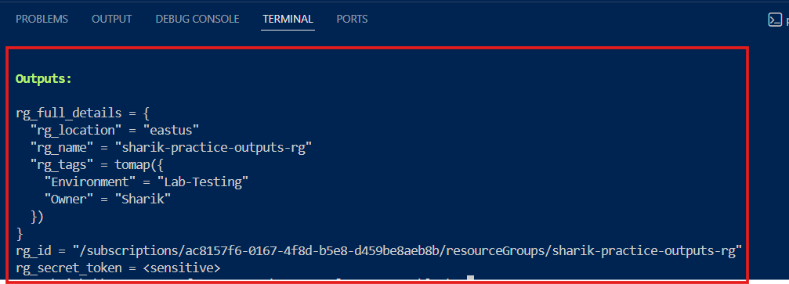

# Terraform Output Blocks Mastery Guide 🚀


---

Welcome to this hands-on, zero-dependency guide to understanding and implementing **Output Blocks** in Terraform using Azure. 

When managing Infrastructure as Code (IaC), creating resources is only half the job. Knowing how to extract, organize, and secure resource data dynamically is what separates a beginner from a production-ready DevOps Engineer.

---

## 🧐 What is a Terraform Output?

Think of Terraform as a food delivery app. When you place an order, you don't just want the food to be cooked; you want to know the delivery status, the rider's phone number, and the estimated time of arrival. 

Similarly, when Terraform finishes creating infrastructure on a cloud provider like Azure, an **Output Block** acts as a return messenger. It extracts critical values generated by the cloud (such as Public IPs, Resource IDs, or Database Endpoints) and brings them straight to your screen or shares them with other automated workflows.

---

## ❓ Why Do We Use It? (Real-World Use Cases)

In production environments, we rarely use outputs just to print text on a terminal. We use them for two main reasons:
1. **CI/CD Pipeline Automation:** Automated pipelines (like GitHub Actions or Jenkins) use these outputs to fetch newly created server IPs and deploy application code onto them.
2. **Cross-Project Collaboration (Remote State):** One team might create the base Network (VNet/Subnets) and output the Subnet IDs. Another team can then read those outputs to launch their Virtual Machines inside that network without touching the original code.

### Is it Compulsory to use Outputs?
**No, it is NOT compulsory.** Terraform will still successfully build, update, and destroy your infrastructure even if you don't write a single line of output. 

However, without outputs, your infrastructure becomes a "black box." You won't easily know the unique attributes created by the cloud provider unless you manually log into the Azure Portal to check them. Therefore, while optional by syntax, they are **highly mandatory by industry standards**.

---

## 📂 Project Architecture & Code Breakdown

Here is an in-depth breakdown of each block implemented in our `main.tf` file:

### 1. The Azure Provider Configuration
```bash
terraform {
  required_providers {
    azurerm = {
      source  = "hashicorp/azurerm"
      version = "~> 3.0"
    }
  }
}

provider "azurerm" {
  features {}
}
```

### Explanation:

 This block tells Terraform that we intend to interact with Microsoft Azure. It downloads the necessary plugins (azurerm) from the HashiCorp registry so Terraform can understand Azure API calls.

 ---

### 2. The Core Resource
```bash
resource "azurerm_resource_group" "sharik_rg" {
  name     = "sharik-practice-outputs-rg"
  location = "East US"
  
  tags = {
    Environment = "Lab-Testing"
    Owner       = "Sharik"
  }
}
```

---

### Explanation: 
This block creates a standard logical container in Azure called a Resource Group. This is our primary target; we will extract data from this specific resource using our output blocks.

---

## 🛠️ The 3 Types of Outputs Explained

**This repository showcases the three fundamental types of outputs used in enterprise environments**:

### Type 1: Simple Output (Primitive Type)
```bash
output "rg_id" {
  value       = azurerm_resource_group.sharik_rg.id
  description = "The subscription ID and full path of the Resource Group."
}
```
---

### How it works: 
It uses reference syntax (resource_type.resource_name.attribute) to target a single, specific string. In this case, it fetches the absolute resource path generated by Azure.

### Best used for:
 Single values like a specific IP address, an ID, or a single URL.

 ---

 ### Type 2: Complex Output (Structural Type)
 ```bash
 output "rg_full_details" {
  value = {
    rg_name     = azurerm_resource_group.sharik_rg.name
    rg_location = azurerm_resource_group.sharik_rg.location
    rg_tags     = azurerm_resource_group.sharik_rg.tags
  }
  description = "A complex map output containing all metadata of the RG."
}
```
---

### How it works:
 Instead of printing multiple separate lines, it groups related variables together into a structured Map (Key-Value pairs) wrapped inside curly braces {}.

### Best used for:
 Bundling multiple configurations together (e.g., grouping a database host, port, and username into a single metadata block).

 ---

 ### Type 3: Sensitive Output (Security Control)
 ```bash
 output "rg_secret_token" {
  value       = "secret-token-for-rg-${azurerm_resource_group.sharik_rg.name}"
  sensitive   = true
  description = "A sensitive string that should not be visible in terminal logs."
}
```
---

### How it works:
 By explicitly defining sensitive = true, you instruct Terraform's engine to mask this value. When terraform apply finishes, it will print <sensitive> instead of showing the actual value on screen.

### Best used for:
 Protecting database passwords, API keys, and SSH private keys from leaking into terminal screens or CI/CD logging systems.

 ---

 ### 💻 How to Run and Test This Project

Follow these steps to run this laboratory locally:

**Initialize the workspace**:
```Bash
terraform init
```
---

**Review the execution plan:**
```Bash
terraform plan
```
---

**Deploy the infrastructure:**
```Bash
terraform apply
```
(Type yes when prompted. You will see the masked and unmasked outputs instantly displayed at the very bottom of your terminal!)
---

### 🎯 Pro DevOps Commands to Try:

**To view outputs at any time without running a full plan/apply**:
```Bash
terraform output
```
---



---

### 🏁 Final Key Takeaways (Terraform Output Blocks)

- Outputs act as a bridge between Terraform and real-world usage (CI/CD, scripts, modules)
- Without outputs, infrastructure becomes a black box and hard to consume
- They are not mandatory for deployment, but mandatory for production-grade DevOps

---


### 🔑 Types of Outputs

- Simple Output → single value (id, ip, name)
- Complex Output → structured data (map/object)
- Sensitive Output → hidden secrets (API keys, passwords, tokens)

---


### ⚙️ Why Outputs Matter

- Used in automation pipelines (GitHub Actions, Jenkins, Azure DevOps)
- Enable cross-team / cross-module communication
- Improve visibility of deployed infrastructure

---

### 🔐 Best Practice

- Never expose secrets directly
- Always use sensitive = true for sensitive data

---

## 🚀 Final Line

**“Terraform builds infrastructure, Outputs make it usable and automatable.”**

---