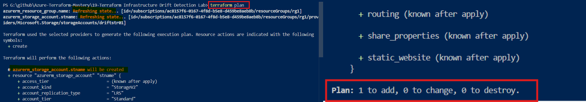

# Infrastructure Drift Detection & Management in Azure


---

## 📌 What is this Lab about?

In real-world jobs, sometimes people go to the **Azure Portal** and accidentally delete or change resources manually. This problem is called **Infrastructure Drift** (when your actual cloud resources don't match your Terraform code).

In this lab, I learned how Terraform catches these manual mistakes and fixes them automatically using simple commands.

---

## 🏗️ What did I build?
* **1 Resource Group** (To hold our resources).
* **1 Storage Account** (Which we will delete to test Terraform).

---

## 🛠️ How I did it (Step-by-Step)

### Step 1: Create the Resources

First, I ran the standard Terraform commands to build the Resource Group and Storage Account in Azure:
```bash
terraform init
terraform plan
terraform apply -auto-approve
```
---

## Step 2: Break it Manually (Simulating a Mistake)

**I logged into the Azure Portal using my browser**.

**I manually deleted the Storage Account from the portal**.

**Now, my Azure Portal was empty, but my Terraform code still had the Storage Account**.

---

# Step 3: Catch the Mistake (Drift Detection)

- I went back to my terminal and ran:
```bash
terraform plan
```
👉 What happened? Terraform checked Azure, found out that the Storage Account was missing, and told me:



**Plan: 1 to add, 0 to change, 0 to destroy**.

---

## Step 4: Fix it Automatically (Remediation)

- To fix the problem and get my Storage Account back, I just ran:
```bash
terraform apply -auto-approve
```

**👉 Result: Without opening the Azure portal or changing any code, Terraform automatically recreated the exact same Storage Account for me!**

---

# 💡 What did I learn?

**Terraform is Smart**: It always checks the live status of Azure before making changes.

**Easy Recovery**: If someone deletes your cloud resources by mistake, you can restore them in seconds using just one command.

**No Manual Work**: DevOps engineers use this feature to keep their cloud infrastructure safe and organized.

---