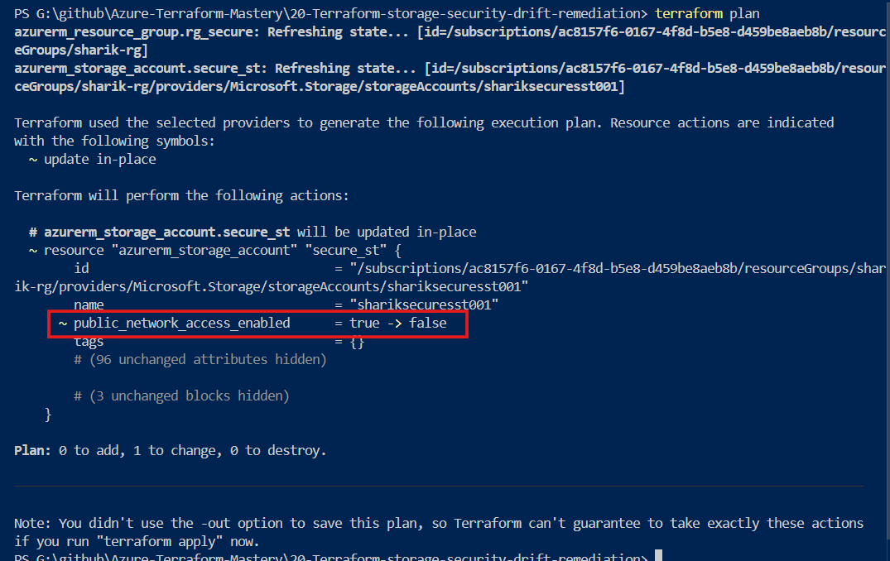

# Terraform Security Drift Detection & Auto Remediation in Azure


---

## 📌 What is this Lab about?

In real cloud jobs, security is everything. Imagine you deploy a super safe, private Azure Storage Account using Terraform. But one day, another employee goes to the **Azure Portal** and manually turns ON **Public Access** to do some quick testing. 

This is a huge **Security Breach** (data leak risk)! This change is called **Security Configuration Drift**.

In this lab, I demonstrated how Terraform instantly catches this dangerous security change and automatically forces the storage account back to being private and safe.

---

## 🏗️ What did I build?

 **1 Resource Group** (The container).
 **1 Secure Storage Account** (With Public Network Access strictly **Disabled** in the code).

---

## 🛠️ How I did it (Step-by-Step)

### Step 1: Deploy the Secure Storage

I wrote the Terraform code with `public_network_access_enabled = false` and deployed it safely to Azure:
```bash
terraform init
terraform plan
terraform apply -auto-approve
```
---

# Step 2: Simulating the Security Breach (The Mistake)

**I logged into the Azure Portal using my browser**.

**Opened the Storage Account, went to Networking settings**.

**Manually changed the setting from Disabled to "Enabled from all networks" and clicked Save**.

**Now, the storage was vulnerable and exposed to the public internet**.

---

# Step 3: Catching the Security Leak

**I went back to my VS Code terminal and checked the status**:
```bash
terraform plan
```
---

### 👉 What happened?

 Terraform immediately caught the mistake! It showed me that the configuration on Azure had changed from **false (Secure)** to **true (Insecure)**.

---
**output**



---

# Step 4: Auto-Fixing the Security Hole

**To fix this security breach instantly without touching the portal, I ran**:
```bash
terraform apply -auto-approve
```
---

### 👉 Result:
- Terraform automatically connected to Azure and modified the setting back to Disabled. The security hole was closed in seconds!

---

# 💡 Key Takeaways

**Security Compliance**:
 Terraform doesn't just check if resources are deleted; it also acts as a security guard checking every single line of setting inside the resource.

**Tamper Proof**:
 No matter what changes users make manually on the Azure Portal, running terraform apply will always fix and lock the infrastructure back to the approved secure code.

---