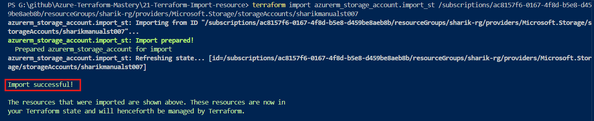

# 🛠️ Lab 21: Mastering Azure Resource Import in Terraform


---

## 📌 What is Terraform Import?

terraform import is a feature that brings already existing resources (manually created on the Azure Portal) into the Terraform State File (terraform.tfstate) without deleting them and without causing any downtime.

---

### ❓ Why and When do we use it?

**Legacy Infrastructure Migration**:

 When a company already has a manually built infrastructure (created using click-click on the portal) and management decides that everything will now be managed via Infrastructure as Code (IaC).

**Emergency Hotfixes**:

 When someone quickly creates a resource directly from the portal to resolve an ongoing incident, and that resource now needs to be safely added to the IaC pipeline.

**No Re-creation Policy**: 

When we cannot delete a running critical resource to recreate it because it contains live company data.

---

## 🏢 Real-World Production Scenario

**The Situation**:

 Sharik joined a company as a Cloud & DevOps Engineer. He found out that before his arrival, a developer had manually created a Storage Account named sharikmanualst007 inside the sharik-rg resource group on the Azure Portal for testing purposes.

**The Problem**: 

Live data is running inside this storage account, so it cannot be deleted. However, the company has a strict policy that all infrastructure must be managed only by Terraform.

**The Task**: 

To bring sharikmanualst007 under Terraform management without any downtime and bring the configuration drift down to zero.

---

### 📂 File Structure
``bash
├── providers.tf       # Azure Provider Configuration
├── main.tf            # Target resource configuration block
└── README.md          # Lab documentation

---

# Before Starting Implementation

- Before you move further with the import process, ensure you have the resource id.

## 🛠️ Step 1: How to Find Your Specific Resource ID

- To get the exact address (Resource ID) of your storage account from the Azure Portal, follow these steps:

**Go to the Azure Portal and open your specific Storage Account (sharikmanualst007)**.

**Click on the Overview section located in the left-hand panel.**

**Look near the top-right corner of the screen and click on JSON View.**

**At the very top of the JSON block, you will see a field named Resource ID. Copy that long string.**

The copied address will look exactly like this:
```bash
/subscriptions/<SUBSCRIPTION_ID>/resourceGroups/sharik-rg/providers/Microsoft.Storage/storageAccounts/sharikmanualst007
```
---
## 🚀 Step-by-Step Implementation Flow

**Step 1: Create an Empty Block in main.tf**

Terraform needs an empty target block in the code to map the state:
```bash
resource "azurerm_storage_account" "import_st" {
  # Leave this empty for now, because the settings will come from the portal
}
```
---

**Step 2: Run the Import Command**

- Go to the terminal and provide two separate arguments with correct spacing (1. Local Terraform Address, 2. Azure Resource ID):
```bash
terraform import azurerm_storage_account.import_st /subscriptions/ac8157f6-0167-4f8d-b5e8-d45
```
---

### 📸 Execution Proof (Import Success):

- Here is the terminal output after running the import command successfully:



---

**Step 3: Drift Detection & Code Sync**

The import command only fills up the state file, but your main.tf is still empty. We run terraform show to pull the live configuration from the state file and sync it inside main.tf:
```bash
resource "azurerm_storage_account" "import_st" {
  name                     = "sharikmanualst007"
  resource_group_name      = "sharik-rg"
  location                 = "East US"
  account_tier             = "Standard"
  account_replication_type = "RAGRS" 
  allow_nested_items_to_be_public = false
}
```
---

**Step 4: Final Plan Verification**

- After syncing all configurations, run terraform plan:
```bash
terraform plan
```
---

### 📸 Final Validation Proof (Zero Changes):

- Everything is fully synced and managed by Terraform now:


---

# ⚡ The Modern Way: Declarative Import Blocks (Terraform 1.5+)

**No more long terminal commands! In newer versions, we can directly write an import {} block inside main.tf to automate bulk migrations**:
```bash
# No need to write a long command on the terminal anymore
import {
  to = azurerm_storage_account.import_st
  id = "/subscriptions/ac8157f6-0167-4f8d-b5e8-d459be8aeb8b/resourceGroups/sharik-rg/providers/Microsoft.Storage/storageAccounts/sharikmanualst007"
}

resource "azurerm_storage_account" "import_st" {
  # Write your attributes here
  name                     = "sharikmanualst007"
  resource_group_name      = "sharik-rg"
  location                 = "East US"
  account_tier             = "Standard"
  account_replication_type = "RAGRS"
  allow_nested_items_to_be_public = false
}
```

After this, running terraform plan and terraform apply directly completes the entire process automatically in one go!

---

# 🎯 Final Outcome & Key Learnings

By completing this lab, we successfully transitioned a manually created Azure resource into Terraform management without any downtime or data loss.

---

## ✅ What We Achieved:

- Imported an existing Azure Storage Account into Terraform state
- Eliminated configuration drift between real infrastructure and IaC
- Ensured zero-downtime onboarding of live production resources
- Understood the difference between state vs configuration
- Learned both CLI-based import and modern declarative import blocks (Terraform 1.5+)

---

## 🧠 Key Takeaways:

- terraform import does NOT create configuration — it only updates the state
- Proper configuration sync is critical to avoid unintended changes
- Import is essential for legacy migration, hotfix recovery, and compliance alignment

---

## 🚀 Real-World Impact

**This approach is widely used in enterprise environments where**:

- Legacy infrastructure needs to be migrated to IaC
- Critical resources cannot be recreated
- Security and compliance require centralized infrastructure management
---

## 👨‍💻 Author

### Sharik Ahmad

---


