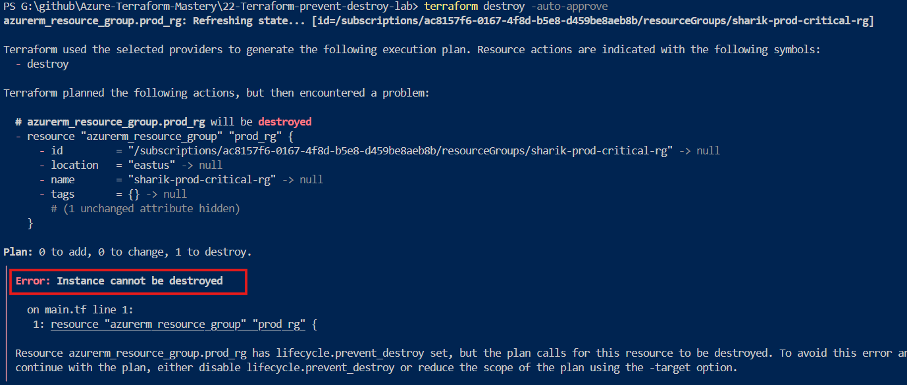

# 🛡️ Production Guardrail: Preventing Accidental Resource Deletion in Azure using Terraform


---

## 📖 Real-World Scenario

It’s a hectic Friday afternoon in a fast-paced DevOps team.

A junior engineer is cleaning up unused staging environments to optimize cloud costs. Confidently, they execute:

```bash
terraform destroy -auto-approve
```

Moments later, panic sets in.

They weren’t in the staging directory.

Instead, they triggered a destroy operation on a **mission-critical production resource group** hosting core applications and databases. 🚨

### 💥 Potential Impact

* ❌ Production outage
* ❌ Critical data loss
* ❌ Business disruption

---

## 🎯 Objective

To eliminate such risks, we implement a **Zero-Trust Deletion Guardrail** using Terraform lifecycle rules.

This ensures that:

* No accidental deletion is possible
* Even automated pipelines cannot destroy critical resources
* Infrastructure remains protected by design

---

## 🔄 Understanding Terraform Lifecycle

By default, Terraform follows:

```
Create → Update → Destroy
```

In production systems, this behavior must be controlled.

Terraform provides a `lifecycle {}` block to override default behavior and enforce safety rules.

---

## 🛡️ What is `prevent_destroy`?

`prevent_destroy` is a lifecycle meta-argument that acts as a **protective guardrail**.

Think of it as a **private bodyguard** for your infrastructure.

---

### 🔍 What does it do?

> **"No matter what happens, do not allow this resource to be destroyed."**

* ❌ Blocks `terraform destroy`
* ❌ Prevents deletion during `apply`
* 🚫 Stops destructive plans instantly

---

### ⚡ When does it trigger?

It activates when:

* `terraform destroy` is executed
* Resource block is removed and `terraform apply` is run
* Any change forces resource replacement

---

### 🚨 Internal Behavior

When Terraform detects:

```hcl
lifecycle {
  prevent_destroy = true
}
```

It will:

* ⛔ Stop execution immediately
* 🔒 Block the entire operation
* ❗ Throw a critical error

---

### ✅ Result

* 💯 Infrastructure remains safe
* 🔐 Protected from human error
* 🚫 No accidental deletion possible

---

## 📂 Project Structure

```
📁 22-Terraform-prevent-destroy-lab/
│
├── 📁 images/
│   └── destroy.png
│
├── providers.tf
├── main.tf
└── README.md
```

---

## ⚙️ Implementation

### 1️⃣ Provider Configuration (`providers.tf`)

```bash
terraform {
  required_version = ">= 1.0.0"

  required_providers {
    azurerm = {
      source  = "hashicorp/azurerm"
      version = "~> 3.0"
    }
  }
}

provider "azurerm" {
  features {}
}
```

---

### 2️⃣ Guardrail Implementation (`main.tf`)

```bash
resource "azurerm_resource_group" "prod_rg" {
  name     = "sharik-prod-critical-rg"
  location = "East US"

  lifecycle {
    prevent_destroy = true
  }
}
```

---

## 🔬 Validation

We simulated a real-world failure scenario:

```bash
terraform destroy -auto-approve
```

### ❗ Output



---

```
Error: Instance cannot be destroyed

Resource azurerm_resource_group.prod_rg has lifecycle.prevent_destroy set,
but the plan calls for this resource to be destroyed.
```

---

### ✅ Outcome

* Infrastructure remains intact
* Terraform blocks destructive action
* Safety enforced at code level

---

## 💡 Production Insights

### 🚀 CI/CD Protection

Even if a pipeline is misconfigured, `prevent_destroy` ensures that critical resources are never deleted.

---

### 🔒 Important Interview Insight

`prevent_destroy` only protects against **Terraform actions**.

👉 It does NOT prevent manual deletion from Azure Portal.

✅ Combine with:

* Azure Resource Locks (`CanNotDelete`)

---

### ⚙️ Controlled Deletion Process

To delete a protected resource:

1. Update code:

   ```hcl
   prevent_destroy = false
   ```
2. Run approved Terraform workflow
3. Apply changes with proper authorization

---

## 🧠 Key Learning

> **"Good infrastructure doesn’t just automate — it protects."**

By embedding guardrails into Terraform, we reduce dependency on human vigilance and build resilient systems.

---

## 🏁 Conclusion

Accidental deletions are inevitable in fast-paced environments.

Using `prevent_destroy`, we:

* 🛡️ Protect production infrastructure
* 🔐 Enforce zero-trust practices
* ⚡ Prevent costly outages

---


