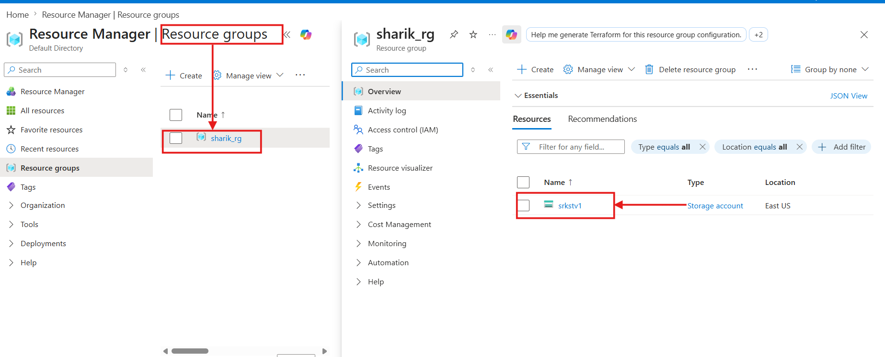
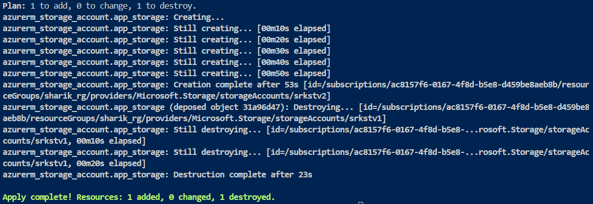

# 🚀 Azure Terraform Advanced Lifecycle Lab: Zero-Downtime Infrastructure Migration

Welcome to this production-grade scenario lab demonstrating how to orchestrate zero-downtime infrastructure replacements in Microsoft Azure using Terraform's native lifecycle meta-arguments and enterprise variables control.

---

## 🎭 The Production Story (The Scenario)

Imagine you are a DevOps Engineer at a fast-growing e-commerce MNC. During a high-traffic flash sale, the performance metrics reveal that the standard core data storage is hitting an I/O bottleneck. The Infrastructure Architect issues an immediate mandate: **Upgrade the core application storage account from the `Standard` HDD tier to the high-performance `Premium` SSD tier immediately.**

---

### 🛑 The Traditional Infrastructure Trap

Normally, if you change an immutable attribute like `account_tier` in Terraform, its default behavior is **Destroy-and-Create**. 

1. Terraform triggers a deletion of your existing storage account (`srkstv1`).
2. Your live application crashes instantly with data disconnect errors.
3. A few minutes later, the new replacement resource is created.

**Business Impact:** High downtime, dropped customer carts, and financial loss.

---

### 🛡️ The Enterprise Solution
To solve this, we implement a **Blue-Green style structural replacement** using Terraform's `create_before_destroy` paradigm controlled gracefully via structured `locals` variables.

---

## 🧠 Core Architecture Concepts

### 1. What is `create_before_destroy`?

By default, Terraform destroys a resource before creating its replacement when an upgrade forces a resource recreate. The `create_before_destroy` meta-argument flips this lifecycle sequence on its head. It forces Terraform to provision the new healthy resource *first*, and only decommission the older stale resource once the new one is successfully active.

---

### 2. Why do we use it?

* **Zero Service Gaps:** Ensures cloud infrastructure footprints never drop down to 0 units during configuration swaps.

* **Safer Rollbacks:** If the creation of the new resource fails midway, the older resource remains untouched and active, preventing a total environment blackout.

---

## 🧠 Why We Used the locals Block

**What is it?**

In Terraform, locals acts like a private variable or a code shortcut (e.g., let version = "v1"), allowing you to reuse the same value across multiple resources.

---

**Why use it here?**
```bash
locals {
  storage_version = "v1" # Easily switch to "v2" for updates
}
```
---

**Central Control**:

 You can upgrade the entire infrastructure version from the very top of the file without touching the resource blocks below.

**Production Predictability**: 

Unlike random string generators that can change unexpectedly during pipeline runs, locals gives you 100% human control. Terraform will never trigger a recreation until YOU manually change "v1" to "v2".

---

## 🛠️ Step-by-Step Phase-wise Implementation

We will complete this entire deployment in two main phases so that the upgrade process can be tracked live.

### 📍 Phase 1: Base Infrastructure Baseline (Standard Tier)

In this phase, we will deploy the first version of our infrastructure (v1), which will run on the Standard performance tier.

---

### 💻 Phase 1 Code Setup (main.tf)
```bash
locals {
  # 🎯 PHASE 1: For the first deployment, keep this as "v1"
  storage_version = "v1"
}

# 1. Resource Group
resource "azurerm_resource_group" "sa_rg" {
  name     = "sharik_rg"
  location = "East US"
}

# 2. Core Storage Account with Lifecycle Guardrail
resource "azurerm_storage_account" "app_storage" {
  # Dynamic Name: srkstv1
  name                     = "srkst${local.storage_version}" 
  resource_group_name      = azurerm_resource_group.sa_rg.name
  location                 = azurerm_resource_group.sa_rg.location
  
  account_tier             = "Standard" 
  account_replication_type = "LRS"

  # 🛡️ The Zero-Downtime Blueprint
  lifecycle {
    create_before_destroy = true
  }
}
```

---

**🚀 Deployment Commands:**
```bash
terraform init
terraform apply -auto-approve
```
---

## 📸 Phase 1 Verification (Azure Portal Snapshot):

After the deployment is complete, our srkstv1 standard storage account is successfully created inside the sharik_rg resource group on the Azure Portal:



---

## 📍 Phase 2: Live Standard-to-Premium Upgrade (The Magic Swap)

Now, based on the business requirements, we will upgrade our infrastructure from v1 to v2 and from the Standard tier to the Premium tier without any downtime.

---

### 💻 Phase 2 Code Updates (main.tf)

We will go to the top of our code and change the storage_version variable to "v2" and switch the account_tier to "Premium":
---
```bash
locals {
  # 🎯 PHASE 2: Manual change for upgrade tracking
  storage_version = "v2" 
}

# ... (Resource group remains same) ...

resource "azurerm_storage_account" "app_storage" {
  name                     = "srkst${local.storage_version}" # Dynamic Name: srkstv2
  resource_group_name      = azurerm_resource_group.sa_rg.name
  location                 = azurerm_resource_group.sa_rg.location
  
  account_tier             = "Premium" # 💥 Tier Upgraded to Premium SSD
  account_replication_type = "LRS"

  lifecycle {
    create_before_destroy = true
  }
}
```
---

**🚀 Execution Upgrade Command**:
```bash
terraform apply -auto-approve
```
---

## 📸 Phase 2 Verification (Terminal Execution Lifecycle Logs):

Watch closely, your terminal will follow this exact sequence without any naming conflicts:



---

## 📊 Deep Dive Log Validation:

**The Plan**: 
Terraform maps the change path: Plan: 1 to add, 0 to change, 1 to destroy.

**The Birth (Creation First)**:
 Instead of deleting v1, Terraform initializes srkstv2 directly: azurerm_storage_account.app_storage: Creating... which finishes cleanly in 53 seconds.

**The Clean-up Handover (Destruction Last)**:
 As soon as Azure confirms that the storage account srkstv2 is online, Terraform securely targets the old deposed object: Destroying... [id=.../storageAccounts/srkstv1] and removes it in 23 seconds.

 ---

 ## Final Result:

  **Zero infrastructure footprint gaps! The old target was deleted only when the new upgraded resource became fully functional**.