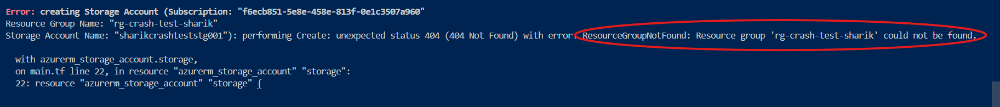

# 🚀 Azure Terraform Dependency Mastery Lab


---

Welcome to the **Terraform Dependency Lab**. This repository is designed to demonstrate how Terraform handles the provisioning order of infrastructure resources on cloud providers like Azure. 

By looking at this lab, anyone can easily understand what dependencies are, why they can cause your deployments to crash, and how to fix them using enterprise-best practices.

---

## 🧠 Core Concepts: What is a Dependency?

In infrastructure-as-code, a **Dependency** means one resource relies on another resource to exist first. For example, you cannot build a house without laying down the foundation first. Similarly, on Azure, you cannot build a **Storage Account** without a **Resource Group** existing beforehand.

There are **two types** of dependencies in Terraform:

### 1. Implicit Dependency (Dynamic Linking)

This happens when you link resources together using dynamic code expressions (using dots `.`). 

* *Example:* `resource_group_name = azurerm_resource_group.rg.name`

* *How it works:* Terraform reads this link, automatically understands the relationship, and builds the Resource Group first. **You should use this 90% of the time.**

### 2. Explicit Dependency (Forced Order)

This is used when two resources have **no direct code link** using variables, but logically one must wait for the other.

* *How it works:* You use the `depends_on` block to manually lock the execution order.

* *Example:* Forcing a VM configuration script to wait until an external Azure Key Vault or Database is completely ready.

---

## 📂 Project Structure & The Story Flow

To thoroughly test this behavior, this lab is divided into **two distinct architectural scenarios**:

### 🛑 Scenario 1: Without Dependency (The Parallel Crash)

In this directory, we intentionally wrote bad code. We hardcoded the string value for the resource group name instead of dynamically referencing it:
```bash
resource "azurerm_storage_account" "storage" {
  name                = "sharikcrashteststg001"
  resource_group_name = "rg-crash-test-sharik" # ❌ Hardcoded string string
  location            = "East US"
  account_tier        = "Standard"
}
```
---

### What Happened? 

**Because there was no dynamic relationship or depends_on block, Terraform's graph engine assumed both resources were independent. It fired up deployment requests for both the Resource Group and the Storage Account simultaneously in parallel.**

### The Result (The Error Encountered):

**The Storage Account request reached Azure faster than the Resource Group could finish building. Azure looked for the group, couldn't find it, and threw a 404 Not Found error.**

**Key takeaway**: Forgetting to map dependencies causes unexpected parallel runtime crashes!



---

### ✨ Scenario 2: With Dependency (The Clean Success)

In this directory, we corrected our architecture using proper dependency tracking. We updated our configuration to utilize an Implicit dynamic link and reinforced it with an Explicit constraint:
```bash
resource "azurerm_storage_account" "storage1" {
  name                     = "shariksafeteststg001"
  resource_group_name      = azurerm_resource_group.rg.name      #  Implicit Link
  location                 = azurerm_resource_group.rg.location  #  Implicit Link
  account_tier             = "Standard"
  account_replication_type = "LRS"

  depends_on = [
    azurerm_resource_group.rg #  Explicit Safety Override
  ]
}
```
---

### What Happened?

**Terraform generated a sequential execution tree. It placed the Storage Account into a holding pattern and waited comfortably until the Resource Group sent a "Creation complete" status update**.

### The Result (Successful State Tracking):

**Both resources deployed flawlessly in perfect chronological order. Running terraform state list confirms that our state tracking file is clean, managed, and fully operational.**


---

# 🧭 Terraform Dependency Cheat Sheet (Simple Version)

## 🤔 When to use what?

| Situation | What to Use | Why |
|----------|------------|-----|
| Creating normal Azure resources (RG → VNet → Subnet → VM) | ✅ Implicit Dependency | Terraform automatically understands the order |
| Passing data from one resource to another (like `.id`, `.name`) | ✅ Implicit Dependency | This already creates a connection, no extra work needed |
| Running script after VM creation | ⚠️ Explicit (`depends_on`) | Script is not directly linked, but needs VM to be ready |
| Deploying apps on Kubernetes cluster | ⚠️ Explicit (`depends_on`) | App needs cluster to be fully ready first |

---

## 🔗 Terraform Dependency (Simple Guide)

### ✅ Implicit Dependency (Automatic)

Terraform automatically understands the dependency.

```bash
resource_group_name = azurerm_resource_group.rg.name
```
---

### 👉 Terraform understands:

**"First create the Resource Group, then create the next resource"**

---

### ⚠️ Explicit Dependency (Manual)

When Terraform cannot understand the dependency, we define it manually.
```bash
depends_on = [azurerm_virtual_machine.vm]
```

### 👉 This means:

**"Wait until the VM is fully created, then run the next step"**

---

### 🔑 Simple Rules

- 👍 Use Implicit Dependency → Default choice (use in most cases)
- 👎 Use Explicit Dependency (depends_on) → Only when needed
- 🚫 Too much depends_on → Makes code slow and hard to manage

---

### 💡 One-Line Trick (For Interview)

**"If Terraform can understand the dependency, I don’t use depends_on. I only use it when Terraform cannot detect it."**

---