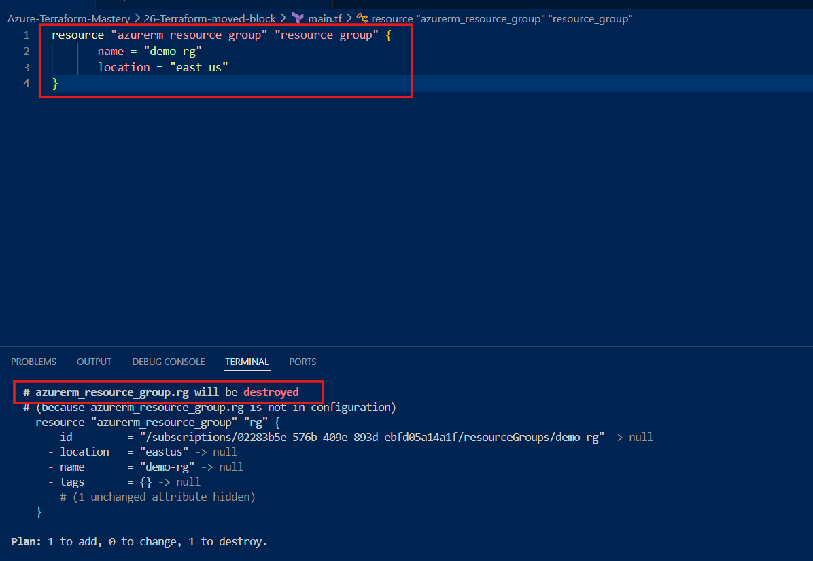
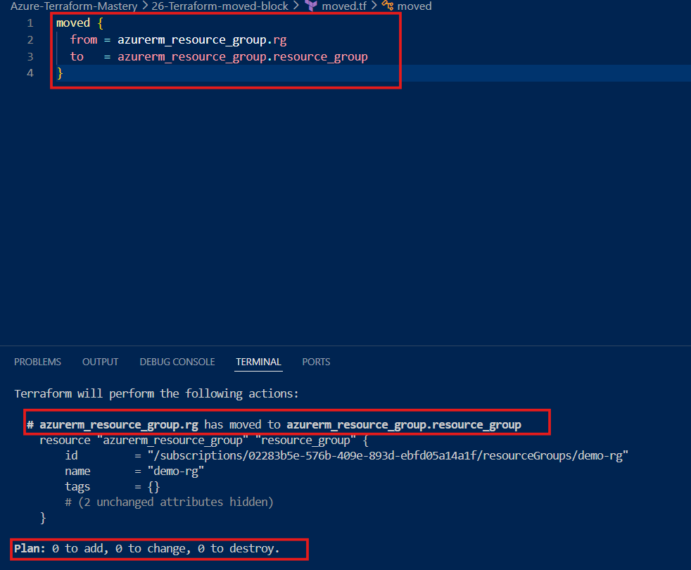
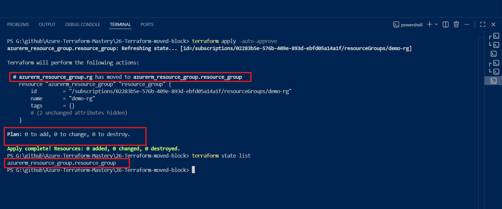

# 🚀 Terraform Moved Block Lab


--

Learn how to safely rename Terraform resource addresses using the moved block without destroying existing Azure infrastructure.

---

# 📌 Overview

When we start learning Terraform, we mostly create resources from scratch.

However, in real projects, the challenge is not creating infrastructure—it's `maintaining and improving existing Terraform code.`

As projects grow, teams introduce coding standards, improve naming conventions, split files into modules, and clean up old code.

During this process, developers often need to rename Terraform resources.

Without proper handling, Terraform may think the old resource was deleted and a new one needs to be created.

That's exactly why the `moved block exists.`

---

## 🤔 What is a Terraform Moved Block?

A moved block tells Terraform:

**"This is the same resource. I only changed its Terraform resource address. Please don't destroy and recreate it."**

It simply updates Terraform's `state` so that the new resource address points to the existing infrastructure.

**Important:**

A `moved` block **does NOT rename Azure resources.**

It only updates the Terraform resource address stored inside the state file.

---

## 🏢 Real-World Scenario

Imagine you join a company where a junior DevOps engineer created the Terraform code.

Everything is working perfectly in Azure.

The infrastructure is healthy.

The only problem is that the Terraform code is difficult to read because the logical resource names are too short.

**For example:**
```bash
resource "azurerm_resource_group" "rg" {
  name     = "demo-rg"
  location = "east us"
}
```

**Although the code works, names like:**

* rg
* vm
* sa
* vnet
don't clearly explain the purpose of the resources.

After a code review, the team decides to follow better naming standards.

**Instead of:**

`rg`

**they want:**

`resource_group`

Notice something important.

**The Azure Resource Group name is still:**

`demo-rg`

Only the `Terraform logical name` is changing.

---

## ❌ What Happens Without a Moved Block?

I renamed the Terraform resource from:

`rg`

to

`resource_group`

Then I executed:

`terraform plan`

Terraform returned:

`- Destroy + Create`

At first this looks strange.

Why is Terraform trying to destroy the Resource Group?

I never changed the Azure resource name.

**The answer is simple.**

Terraform compares its configuration with the `Terraform State.`

Before renaming, the state contained:

`azurerm_resource_group.rg`

After renaming the code, Terraform searched for:

`azurerm_resource_group.resource_group`

Since those addresses don't match, Terraform assumes:

The old resource was deleted.
A completely new resource was added.

That's why it plans a`Destroy + Create` operation.

---

### ✅ The Solution

Instead of allowing Terraform to recreate the infrastructure, I created a new file called:

`moved.tf`

Inside that file I added a `moved block`.

The moved block tells Terraform:

`"Don't worry. This isn't a new resource. I only changed its Terraform address."`

After adding the moved block, I executed:

`terraform plan`

Terraform now understands the relationship between the old and new resource addresses.

The output becomes:

`No changes Infrastructure matches the configuration.`


Exactly what we wanted.

---

### 🎉 Final Result

Finally, I ran:

`terraform apply`

Terraform updated only its `state file.`

The Azure Resource Group was `never recreated.`

The final output showed:

`0 Added 0 Changed 0 Destroyed`

The only thing that changed was the Terraform resource address.

---

## 📂 Project Structure
```bash
terraform-moved-block/
│
├── provider.tf
├── main.tf
├── moved.tf
├── screenshots/
├── README.md
```
---

## 🧪 Hands-on Lab

### Step 1

Deploy an Azure Resource Group.

**Run:**
```bash
terraform init
terraform plan
terraform apply
```

Verify the Terraform state.

### 📸 Screenshot 

`azurerm_resource_group.rg`


---

### Step 2

Rename the Terraform logical resource.

**Before:**

`rg`

**After:**

`resource_group`

`Run:`

`terraform plan`

Terraform plans to recreate the resource.

### 📸 Screenshot 2

`- Destroy + Create`



---

### Step 3

Create a new file:

`moved.tf`

Add the moved block.

Run:

`terraform plan`

Terraform now recognizes the resource correctly.

### 📸 Screenshot 3

`No changes Infrastructure matches the configuration.`



---

### Step 4

Apply the configuration.

`terraform apply`

Terraform updates only its state.

### 📸 Screenshot 4

`0 Added 0 Changed 0 Destroyed`

`azurerm_resource_group.resource_group`



---

### 💡 Key Learnings

* ✅A moved block does not rename Azure resources.
* ✅It only updates the Terraform resource address inside the state.
* ✅It prevents unnecessary destroy and recreate operations.
* ✅It helps safely refactor Terraform code.
* ✅It is commonly used when improving naming conventions or moving resources between modules.
* ✅It is a valuable feature for production environments where infrastructure must remain available.

### 🎯 Interview Questions

**1. What is a Terraform moved block?**

A moved block tells Terraform that a resource has only changed its Terraform resource address and should not be recreated.

**2. Does a moved block rename Azure resources?**

No.

It only updates Terraform's state.

**3. Why did Terraform plan to destroy my resource after renaming it?**

Because Terraform could no longer match the new resource address with the address stored in the state file.

**4. What problem does a moved block solve?**

It prevents unnecessary infrastructure replacement during Terraform code refactoring.

**5. When should you use a moved block?**

* ✅Renaming Terraform resources
* ✅Improving naming conventions
* ✅Moving resources into modules
* ✅Refactoring Terraform code

---


### ⭐ Conclusion

* The moved block is a small feature with a big impact.

* It allows developers to improve Terraform code without affecting existing infrastructure.

* Instead of destroying and recreating resources, Terraform simply updates its state and continues managing the same infrastructure safely.

* Understanding this concept is an important step toward writing production-ready Terraform code.

---

